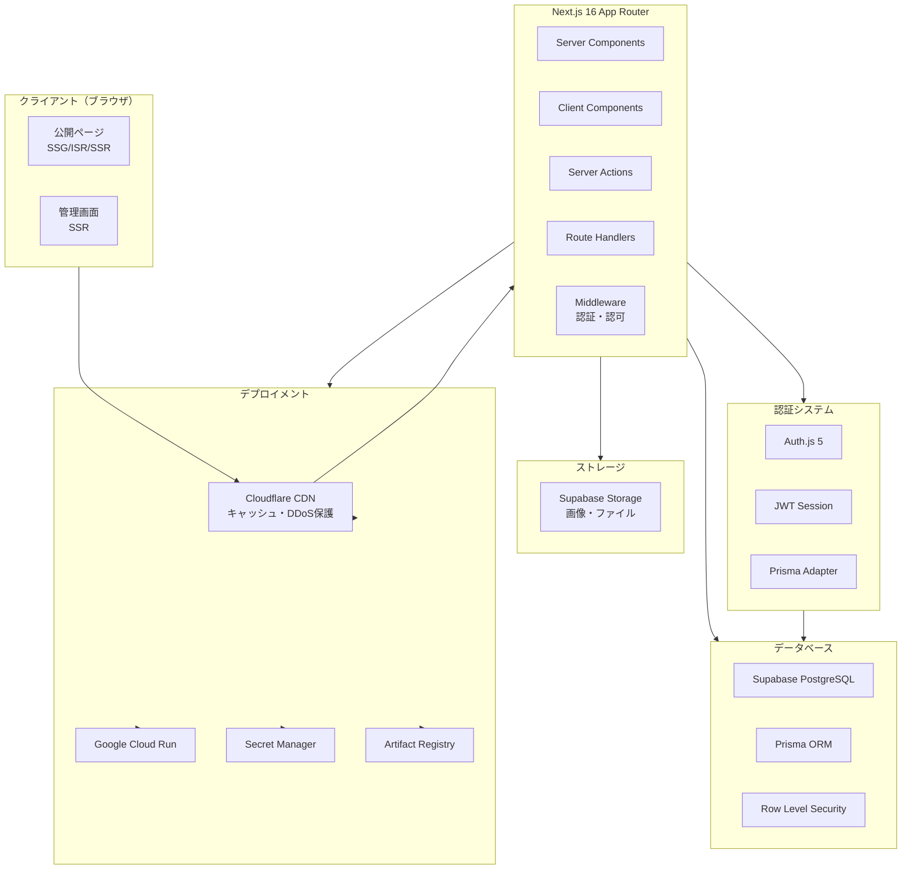
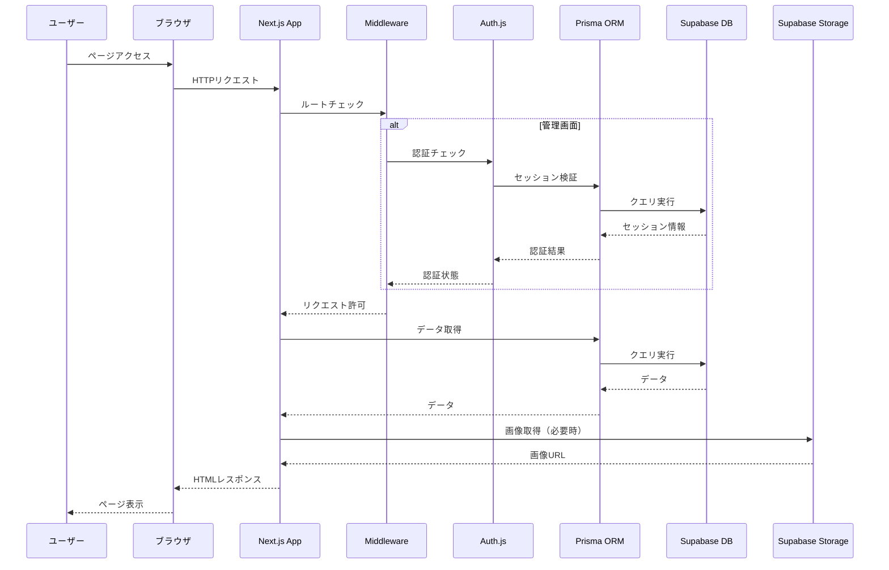
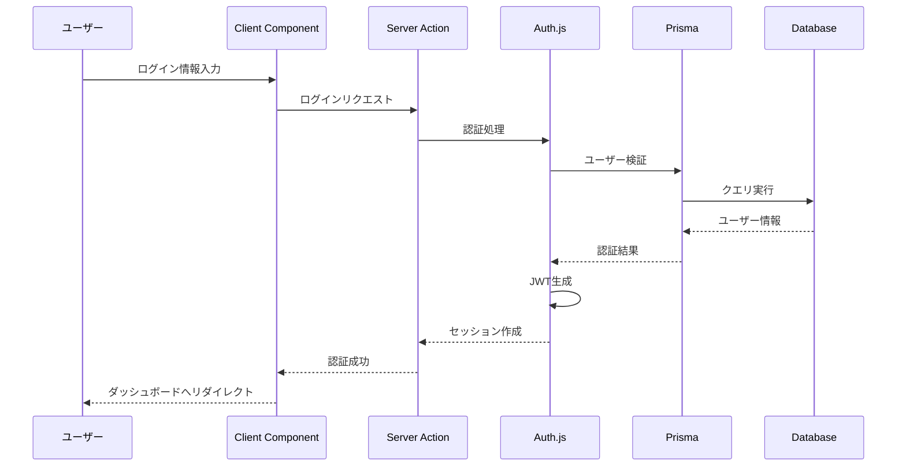
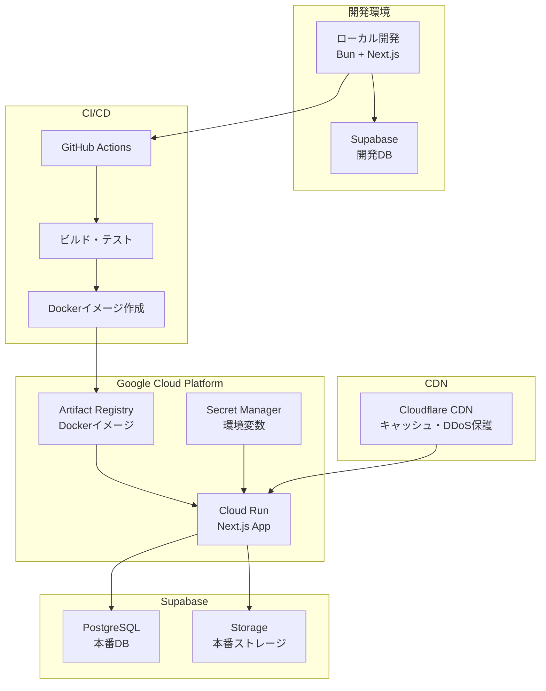

# システムアーキテクチャ

> **Note**: このドキュメントにはシステム全体のアーキテクチャ設計と技術検証結果が記載されています。技術スタックの詳細については、[`AGENTS.md`](../AGENTS.md)を参照してください。

## 実装方針

**後方互換性を考慮しないクリーンな実装**: このプロジェクトは、最新の公式ベストプラクティスに準拠したクリーンでモダンな実装を優先します。古いバージョンや非推奨APIとの後方互換性は維持しません。すべての実装は、フレームワークとライブラリの最新の安定版を使用し、レガシーな回避策なしに公式推奨事項に従う必要があります。

---

## システム概要

レンタルスペース管理システムは、Next.js 16 App RouterをベースとしたフルスタックWebアプリケーションです。公開ページと管理画面の2つの主要なインターフェースを提供します。

---

## アーキテクチャ図

### システム全体アーキテクチャ

### データフロー図

### 認証フロー図

### デプロイメントアーキテクチャ

---

## 技術スタック

> **Note**: 技術スタックの詳細なバージョン情報とセットアップ手順については、[`AGENTS.md`](../AGENTS.md)の「Technical stack」セクションを参照してください。

### フロントエンド

- **Next.js 16.1.1**: App Router、Server Components、SSR/SSG/ISR（CVE-2025-55182修正版）
- **React 19.2.3**: UIライブラリ（CVE-2025-55182修正版）
- **TypeScript 5.9.3**: 型安全性
- **Tailwind CSS 4.1.18**: スタイリング
- **GSAP / Framer Motion**: アニメーション
- **Three.js / Pixi.js**: 3D/2Dグラフィックス

### バックエンド

- **Next.js Server Actions**: サーバーサイドロジック
- **Next.js Route Handlers**: APIエンドポイント
- **Prisma 7.2.0**: ORM
- **Zod 4.3.5**: スキーマバリデーション

### データベース

- **Supabase PostgreSQL**: リレーショナルデータベース
- **Prisma ORM**: データベースアクセス層
- **Row Level Security (RLS)**: データベースレベルセキュリティ

### 認証

- **Auth.js 5**: 認証システム
- **JWT**: セッション管理
- **Prisma Adapter**: データベース統合

### ストレージ

- **Supabase Storage**: 画像・ファイル保存
- **Supabase CDN**: 画像配信（Supabase Storage内蔵）

### デプロイメント

- **Cloudflare CDN**: グローバルCDN、DDoS保護、キャッシュ最適化（推奨）
- **Google Cloud Run**: アプリケーション実行環境
- **Artifact Registry**: Dockerイメージレジストリ
- **Secret Manager**: 機密情報管理
- **GitHub Actions / Cloud Build**: CI/CD

---

## 技術検証結果

### 互換性検証

#### ✅ 検証済み・動作確認済み

| 技術 | 状態 | 備考 |
|------|------|------|
| Next.js 16.1.1 + React 19.2.3 | ✅ | 最新安定版（CVE-2025-55182修正済み） |
| Prisma 7.2.0 + Supabase | ✅ | 完全互換、接続プーリング推奨 |
| Bun 1.3.5 | ✅ | フルBunで実行可能（開発・本番） |
| Zod 4.3.5 | ✅ | 完全互換 |
| Tailwind CSS | ✅ | 完全互換 |
| Three.js / Pixi.js | ✅ | 動的インポートで使用可能 |
| GSAP / Framer Motion | ✅ | 使用可能 |
| Turbopack | ✅ | Next.js 16でデフォルト有効 |

#### ⚠️ 注意が必要な点

**1. PrismaとEdge Runtime**
- PrismaはEdge Runtimeをサポートしていない
- Next.js API Routes/Server Actionsは`runtime = "nodejs"`を指定（またはデフォルト）
- BunランタイムはNode.js互換性があるため、Prismaと互換

**2. Auth.js 5とPrisma Adapter**
- `@auth/prisma-adapter`の最新版を使用
- Prisma 7.2使用時は互換性を確認
- JWTセッションストラテジー推奨（パフォーマンス向上）

**3. Three.js/Pixi.jsのSSR**
- SSR/SSG時は動的インポートでクライアントサイドのみロード
- 詳細は[`PROJECT_STRUCTURE.md`](./PROJECT_STRUCTURE.md)を参照

**4. Supabase RealtimeとPrisma**
- RealtimeサブスクリプションはSupabase Clientを直接使用
- Prismaクエリと併用可能

### セキュリティ検証

#### 重大なセキュリティ脆弱性（CVE-2025-55182）

- **影響範囲**: React 19.0-19.2.0、Next.js 15.x-16.0.6
- **深刻度**: 重大（認証されていないリモートコード実行が可能）
- **必須対応**: 
  - React 19.2.1以上にアップグレード（最新安定版: 19.2.3）
  - Next.js 16.0.7以上にアップグレード（最新安定版: 16.1.1）
- **詳細**: React Server Componentsの脆弱性により、サーバー上でリモートコード実行が可能

詳細は[`SECURITY.md`](./SECURITY.md)を参照してください。

### デプロイ検証

#### Google Cloud Run

- **ランタイム**: Bun 1.3.5（Dockerイメージ内で実行）
- **ベースイメージ**: `oven/bun:1.3.5`
- **ビルド**: `bun run build`（Dockerイメージ内で実行）
- **環境変数**: Secret Managerから注入
- **スケーリング**: 自動スケーリング設定

詳細は[`DEPLOYMENT.md`](./DEPLOYMENT.md)と[`DOCKER.md`](./DOCKER.md)を参照してください。

#### Supabase

- **データベース**: PostgreSQL（マネージド）
- **Storage**: 画像・ファイル保存
- **Realtime**: WebSocket接続
- **Edge Functions**: 必要に応じて（メール送信等）

### リスクと対策

| リスク | 影響度 | 対策 | 状態 |
|--------|--------|------|------|
| React/Next.js セキュリティ脆弱性（CVE-2025-55182） | **重大** | React 19.2.3、Next.js 16.1.1に即座にアップグレード | ⚠️ **即座に対応必須** |
| Prisma Edge Runtime非対応 | 高 | Node.js Runtimeを明示的に指定 | ✅ 対策済み |
| Auth.js 5とPrisma Adapterの互換性 | 中 | 最新安定版を使用、バージョン固定 | ✅ 対策済み |
| Three.js/Pixi.jsのSSR問題 | 中 | 動的インポートでクライアントサイドのみ | ✅ 対策済み |
| Supabase接続プーリング | 低 | 適切な接続URL設定 | ✅ 対策済み |
| Cloud RunでのBun実行 | 低 | Dockerイメージ内でBunを使用 | ✅ 実装済み |

---

## アーキテクチャパターン

### Server Components優先アーキテクチャ

- **デフォルト**: すべてのコンポーネントはServer Component
- **Client Component**: インタラクティブ要素のみ`'use client'`を使用
- **利点**: 
  - クライアント側JavaScriptバンドルサイズの削減
  - SEO最適化
  - サーバーサイドでの直接データベースアクセス

### レンダリング戦略

- **SSG (Static Site Generation)**: 静的コンテンツ（プライバシーポリシーなど）
- **ISR (Incremental Static Regeneration)**: 半静的コンテンツ（スペース詳細、お知らせ）
- **SSR (Server-Side Rendering)**: 動的コンテンツ（予約ページ、管理画面）

### データフェッチング

- **Server Components**: 直接Prismaでデータ取得（`await`を直接使用）
- **Server Actions**: フォーム送信、データ変更（`'use server'`ディレクティブ）
- **Route Handlers**: 外部API連携、Webhook受信
- **並列フェッチング**: `Promise.all`で複数のデータを並列取得

### キャッシュ戦略

詳細は [`CACHING_STRATEGY.md`](./CACHING_STRATEGY.md) を参照してください。

- **Next.js Cache API**: 自動キャッシュ（Server Components）
- **`unstable_cache`**: 関数結果のキャッシュ（タグベースの無効化に対応）
- **`unstable_noStore`**: 動的データのキャッシュ無効化
- **`fetch()`のキャッシュオプション**: `force-cache`（デフォルト）、`no-store`、`revalidate`
- **ISR**: 時間ベースの再生成（`revalidate`オプション）
- **On-demand Revalidation**: 
  - `revalidatePath`: 特定のパスのキャッシュを無効化
  - `revalidateTag`: タグベースでキャッシュを無効化
  - `updateTag`: タグのタイムスタンプを更新
  - `refresh`: 現在のページのキャッシュを更新

---

## セキュリティアーキテクチャ

> **Note**: セキュリティの詳細なポリシーとベストプラクティスについては、[`SECURITY.md`](./SECURITY.md)を参照してください。

### 認証・認可

- **Middleware**: ルートレベルの保護
- **Server Actions**: 関数レベルの権限チェック
- **RLS**: データベースレベルのセキュリティ
- **Auth.js 5**: 業界標準の認証ライブラリを使用

### データ保護

- **入力検証**: Zodスキーマでクライアント・サーバー両方で検証
- **SQLインジェクション対策**: Prisma ORM（パラメータ化クエリ）
- **XSS対策**: React自動エスケープ
- **CSRF対策**: Auth.js内蔵機能

### 環境変数管理

- **開発**: `.env.local`（Gitにコミットしない）
- **本番**: Google Secret Manager
- **機密情報**: ハードコード禁止

---

## パフォーマンス最適化

### レンダリング最適化

- Server Componentsでクライアント側JavaScript削減
- 適切なレンダリング戦略の選択
- 画像最適化（Next.js Image Component）

### データベース最適化

- 適切なインデックス設定（詳細は[`DATABASE_DESIGN.md`](./DATABASE_DESIGN.md)を参照）
- Prisma `select`で必要なフィールドのみ取得
- 接続プーリング（Supabase接続プーリングURLを使用）

### バンドルサイズ最適化

- 動的インポート（Three.js、Pixi.js）
- ルートベースのコード分割
- Tree-shaking
- **Turbopack**: Next.js 16ではTurbopackがデフォルトのバンドラーとして使用され、ビルド時間が2-5倍短縮され、バンドルサイズも最適化される。詳細は [`TURBOPACK_REQUIREMENTS.md`](./TURBOPACK_REQUIREMENTS.md) を参照

### 画像最適化

- Next.js Image Componentを使用
- Supabase Storageと統合
- WebP形式への変換

---

## スケーラビリティ

### 水平スケーリング

- Google Cloud Runの自動スケーリング
- ステートレスアーキテクチャ
- データベース接続プーリング

### パフォーマンスモニタリング

- Next.js Analytics
- データベースクエリパフォーマンス監視
- エラートラッキング

---

## 推奨実装順序

1. **フェーズ1**: プロジェクトセットアップ
   - Next.js + TypeScript + Tailwind CSS
   - Prisma + Supabase接続
   - 基本認証（Auth.js）

2. **フェーズ2**: データベース設計
   - Prismaスキーマ作成
   - マイグレーション実行
   - シードデータ投入

3. **フェーズ3**: 公開ページ（基本機能）
   - ホームページ（シンプル版）
   - スペース詳細ページ
   - 予約ページ（基本フォーム）

4. **フェーズ4**: 管理画面
   - 認証保護
   - ダッシュボード
   - CRUD操作

5. **フェーズ5**: デザイン強化
   - Three.js/Pixi.js統合
   - GSAP/Motionアニメーション
   - UI/UX改善

6. **フェーズ6**: デプロイ・最適化
   - Cloud Runデプロイ
   - パフォーマンス最適化
   - セキュリティ監査

詳細は[`FEATURE_REQUIREMENTS.md`](./FEATURE_REQUIREMENTS.md)を参照してください。

---

## 参考資料

### プロジェクトドキュメント

- [`AGENTS.md`](../AGENTS.md) - プロジェクト全体の仕様書（技術スタック詳細）
- [`FEATURE_REQUIREMENTS.md`](./FEATURE_REQUIREMENTS.md) - 機能要件
- [`DATABASE_DESIGN.md`](./DATABASE_DESIGN.md) - データベース設計
- [`API.md`](./API.md) - API仕様
- [`PROJECT_STRUCTURE.md`](./PROJECT_STRUCTURE.md) - プロジェクト構造
- [`DEPLOYMENT.md`](./DEPLOYMENT.md) - デプロイメント手順
- [`DOCKER.md`](./DOCKER.md) - Docker設定ガイド
- [`SECURITY.md`](./SECURITY.md) - セキュリティポリシー
- [`BUN_RUNTIME.md`](./BUN_RUNTIME.md) - Bunランタイムガイド
- [`TURBOPACK_REQUIREMENTS.md`](./TURBOPACK_REQUIREMENTS.md) - Turbopack要件定義
- [`CLOUDFLARE_CDN.md`](./CLOUDFLARE_CDN.md) - Cloudflare CDN統合ガイド
- [`BEST_PRACTICES.md`](./BEST_PRACTICES.md) - ベストプラクティスガイド
- [`CACHING_STRATEGY.md`](./CACHING_STRATEGY.md) - キャッシング戦略ガイド

### 外部リソース

- [Next.js 16 Documentation](https://nextjs.org/docs)
- [Prisma Documentation](https://www.prisma.io/docs)
- [Auth.js Documentation](https://authjs.dev)
- [Supabase Documentation](https://supabase.com/docs)
- [Google Cloud Run Documentation](https://cloud.google.com/run/docs)
