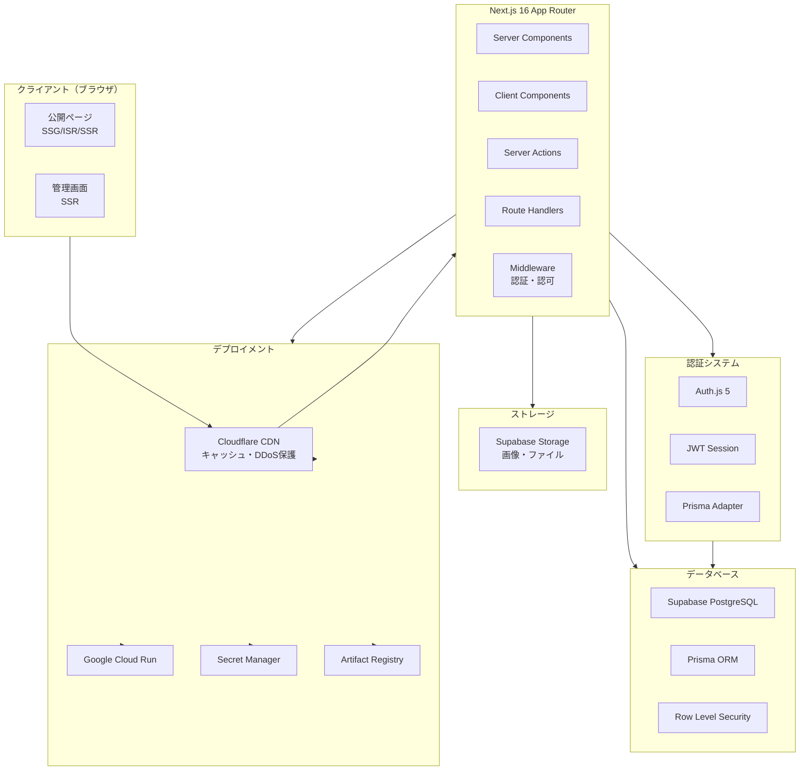
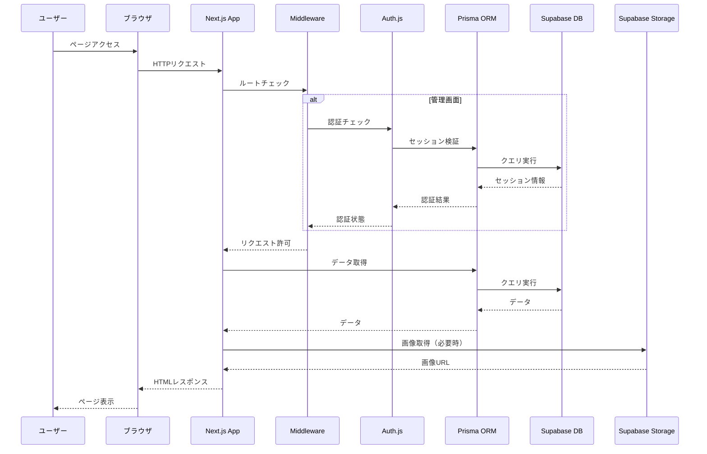
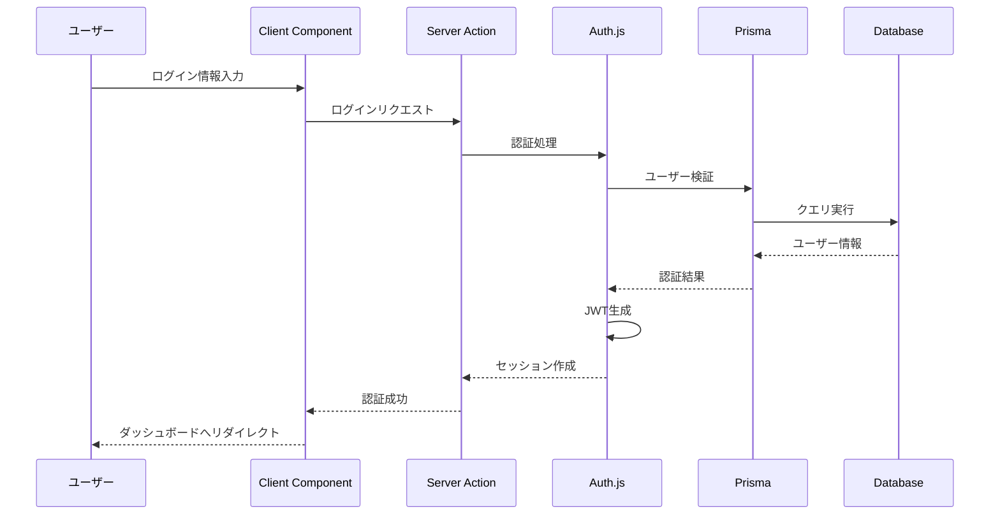
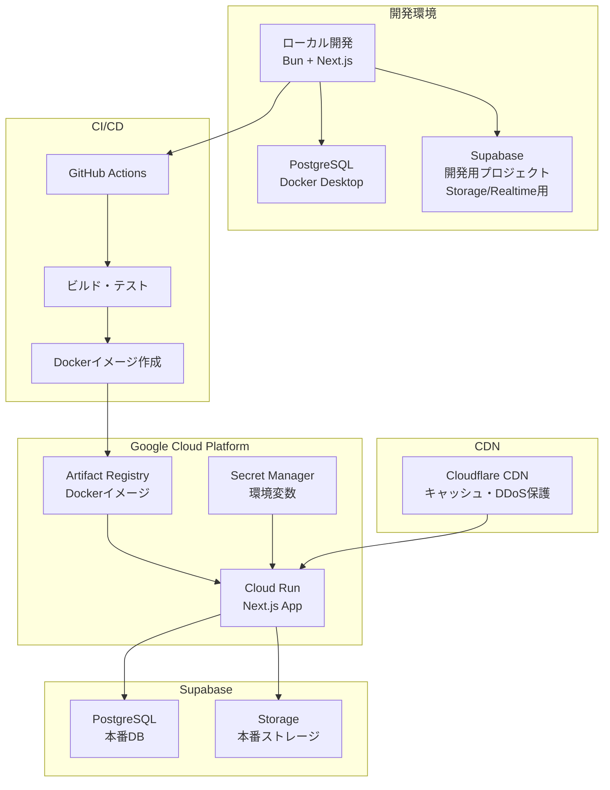

# システムアーキテクチャ

> **Note**: このドキュメントにはシステム全体のアーキテクチャ設計と技術検証結果が記載されています。技術スタックの詳細については、[`AGENTS.md`](../AGENTS.md)を参照してください。

## 実装方針

**後方互換性を考慮しないクリーンな実装**: このプロジェクトは、最新の公式ベストプラクティスに準拠したクリーンでモダンな実装を優先します。古いバージョンや非推奨APIとの後方互換性は維持しません。すべての実装は、フレームワークとライブラリの最新の安定版を使用し、レガシーな回避策なしに公式推奨事項に従う必要があります。

---

## システム概要

レンタルスペース管理システムは、Next.js 16 App RouterをベースとしたフルスタックWebアプリケーションです。公開ページと管理画面の2つの主要なインターフェースを提供します。

---

## アーキテクチャ図

### システム全体アーキテクチャ



### データフロー図



### 認証フロー図



### デプロイメントアーキテクチャ



---

## 技術スタック

> **Note**: 技術スタックの詳細なバージョン情報とセットアップ手順については、[`AGENTS.md`](../AGENTS.md)の「Technical stack」セクションを参照してください。

### フロントエンド

- **Next.js 16.1.1**: App Router、Server Components、SSR/SSG/ISR（CVE-2025-55182修正版）
- **React 19.2.3**: UIライブラリ（CVE-2025-55182修正版）
- **TypeScript 5.9.3**: 型安全性
- **Tailwind CSS 4.1.18**: スタイリング
- **GSAP / Framer Motion**: アニメーション
- **Three.js / Pixi.js**: 3D/2Dグラフィックス

### バックエンド

- **Next.js Server Actions**: サーバーサイドロジック
- **Next.js Route Handlers**: APIエンドポイント
- **Prisma 7.2.0**: ORM
- **Zod 4.3.5**: スキーマバリデーション

### データベース

- **Supabase PostgreSQL**: リレーショナルデータベース
- **Prisma ORM**: データベースアクセス層
- **Row Level Security (RLS)**: データベースレベルセキュリティ

### 認証

- **Auth.js 5**: 認証システム
- **JWT**: セッション管理
- **Prisma Adapter**: データベース統合

### ストレージ

- **Supabase Storage**: 画像・ファイル保存
- **Supabase CDN**: 画像配信（Supabase Storage内蔵）

### デプロイメント

- **Cloudflare CDN**: グローバルCDN、DDoS保護、キャッシュ最適化（推奨）
- **Google Cloud Run**: アプリケーション実行環境
- **Artifact Registry**: Dockerイメージレジストリ
- **Secret Manager**: 機密情報管理
- **GitHub Actions / Cloud Build**: CI/CD

---

## 技術検証結果

### 互換性検証

#### ✅ 検証済み・動作確認済み

| 技術 | 状態 | 備考 |
|------|------|------|
| Next.js 16.1.1 + React 19.2.3 | ✅ | 最新安定版（CVE-2025-55182修正済み） |
| Prisma 7.2.0 + Supabase | ✅ | 完全互換、接続プーリング推奨 |
| Bun 1.3.5 | ✅ | フルBunで実行可能（開発・本番） |
| Zod 4.3.5 | ✅ | 完全互換 |
| Tailwind CSS | ✅ | 完全互換 |
| Three.js / Pixi.js | ✅ | 動的インポートで使用可能 |
| GSAP / Framer Motion | ✅ | 使用可能 |
| Turbopack | ✅ | Next.js 16でデフォルト有効 |

#### ⚠️ 注意が必要な点

**1. Prisma 7とDriver Adapters**
- Prisma 7では、データベース接続にdriver adaptersが**必須**
- PostgreSQLの場合は`@prisma/adapter-pg`を使用
- 接続プーリングはNode.js driver（`pg`）で管理
- PrismaはEdge Runtimeをサポートしていない
- Next.js API Routes/Server Actionsは`runtime = "nodejs"`を指定（またはデフォルト）
- BunランタイムはNode.js互換性があるため、Prismaと互換
- 詳細は[`PRISMA_7.md`](./PRISMA_7.md)と[`BEST_PRACTICES.md`](./BEST_PRACTICES.md)を参照

**2. Auth.js 5とPrisma Adapter**
- `@auth/prisma-adapter`の最新版を使用
- Prisma 7.2使用時は互換性を確認
- JWTセッションストラテジー推奨（パフォーマンス向上）

**3. Three.js/Pixi.jsのSSR**
- SSR/SSG時は動的インポートでクライアントサイドのみロード
- 詳細は[`PROJECT_STRUCTURE.md`](./PROJECT_STRUCTURE.md)を参照

**4. Supabase RealtimeとPrisma**
- RealtimeサブスクリプションはSupabase Clientを直接使用
- Prismaクエリと併用可能

### セキュリティ検証

#### 重大なセキュリティ脆弱性（CVE-2025-55182）

- **影響範囲**: React 19.0-19.2.0、Next.js 15.x-16.0.6
- **深刻度**: 重大（認証されていないリモートコード実行が可能）
- **必須対応**: 
  - React 19.2.1以上にアップグレード（最新安定版: 19.2.3）
  - Next.js 16.0.7以上にアップグレード（最新安定版: 16.1.1）
- **詳細**: React Server Componentsの脆弱性により、サーバー上でリモートコード実行が可能

詳細は[`SECURITY.md`](./SECURITY.md)を参照してください。

### デプロイ検証

#### Google Cloud Run

- **ランタイム**: Bun 1.3.5（Dockerイメージ内で実行）
- **ベースイメージ**: `oven/bun:1.3.5`
- **ビルド**: `bun run build`（Dockerイメージ内で実行）
- **環境変数**: Secret Managerから注入
- **スケーリング**: 自動スケーリング設定

詳細は[`DEPLOYMENT.md`](./DEPLOYMENT.md)と[`DOCKER.md`](./DOCKER.md)を参照してください。

#### Supabase

- **データベース**: PostgreSQL（マネージド）
- **Storage**: 画像・ファイル保存
- **Realtime**: WebSocket接続
- **Edge Functions**: 必要に応じて（メール送信等）

### リスクと対策

| リスク | 影響度 | 対策 | 状態 |
|--------|--------|------|------|
| React/Next.js セキュリティ脆弱性（CVE-2025-55182） | **重大** | React 19.2.3、Next.js 16.1.1に即座にアップグレード | ⚠️ **即座に対応必須** |
| Prisma Edge Runtime非対応 | 高 | Node.js Runtimeを明示的に指定 | ✅ 対策済み |
| Auth.js 5とPrisma Adapterの互換性 | 中 | 最新安定版を使用、バージョン固定 | ✅ 対策済み |
| Three.js/Pixi.jsのSSR問題 | 中 | 動的インポートでクライアントサイドのみ | ✅ 対策済み |
| Supabase接続プーリング | 低 | 適切な接続URL設定 | ✅ 対策済み |
| Cloud RunでのBun実行 | 低 | Dockerイメージ内でBunを使用 | ✅ 実装済み |

---

## アーキテクチャパターン

### UI 完全分離アーキテクチャ

**管理画面と公開ページは完全に別物。UI は完全分離、ロジック/データは共有。**

```
src/
├── app/
│   ├── (public)/             # 公開ページルーティング
│   ├── admin/                # 管理画面ルーティング
│   └── api/                  # API Routes（共有）
│
├── components/
│   ├── admin/                # 管理画面 UI（完全独立）
│   │   ├── ui/               # shadcn/ui コンポーネント
│   │   ├── layouts/          # AdminSidebar 等
│   │   ├── forms/            # LoginForm, SpaceForm 等
│   │   └── features/         # Dashboard, SpaceList 等
│   │
│   └── site/                 # 公開ページ UI（完全独立）
│       ├── ui/               # カスタムコンポーネント（tv ベース）
│       ├── layouts/          # Header, Footer
│       └── sections/         # Hero, SpaceList, CTA 等
│
├── actions/                  # Server Actions（共有）
├── lib/                      # ユーティリティ（共有）
│   ├── prisma.ts
│   ├── auth.ts
│   └── utils.ts              # cn 関数
└── types/                    # 型定義（共有）
```

#### UI ライブラリ構成

| 領域 | UI ライブラリ | バリアント管理 | スタイリング |
|------|-------------|---------------|-------------|
| 管理画面 | shadcn/ui | CVA（shadcn 内蔵） | clsx + tailwind-merge |
| 公開ページ | カスタム | tailwind-variants (tv) | clsx + tailwind-merge |

> **Note**: shadcn/ui は内部で [CVA (class-variance-authority)](https://cva.style/docs) を使用。
> 管理画面に tailwind-variants は不要（CVA と機能が重複するため）。

#### 共有するもの（ロジック層）

- **データベース**: Prisma Client (`src/lib/prisma.ts`)
- **認証**: Auth.js (`src/lib/auth.ts`)
- **Server Actions**: `src/actions/` 配下
- **型定義**: `src/types/` 配下
- **バリデーション**: Zod スキーマ (`src/lib/validations/`)
- **ユーティリティ**: `src/lib/utils.ts` (cn 関数)

#### 共有しないもの（UI 層）

- UI コンポーネント（Button, Input, Card 等）
- レイアウトコンポーネント
- ページセクション

### Server Components 優先アーキテクチャ

- **デフォルト**: すべてのコンポーネントは Server Component
- **Client Component**: インタラクティブ要素のみ `'use client'` を使用
- **利点**:
  - クライアント側 JavaScript バンドルサイズの削減
  - SEO 最適化
  - サーバーサイドでの直接データベースアクセス

### レンダリング戦略

- **SSG (Static Site Generation)**: 静的コンテンツ（プライバシーポリシーなど）
- **ISR (Incremental Static Regeneration)**: 半静的コンテンツ（スペース詳細、お知らせ）
- **SSR (Server-Side Rendering)**: 動的コンテンツ（予約ページ、管理画面）
- **PPR (Partial Prerendering) / Cache Components**: 静的コンテンツと動的コンテンツを同じルート内で組み合わせ（Next.js 16の`cacheComponents`設定で有効化、`"use cache"`ディレクティブで明示的なキャッシュ制御）
- **CSR (Client-Side Rendering)**: クライアントサイドのみでレンダリング（`'use client'`ディレクティブ + `dynamic`インポートで`ssr: false`を指定）

### データフェッチング（2026年最新パターン）

| 領域 | 技術 | パターン |
|------|------|----------|
| データ取得 | Server Components | async コンポーネントで直接 Prisma |
| データ変更 | Server Actions | `'use server'` + `revalidatePath` |
| 認証 | Auth.js 5 | `proxy.ts` + `auth()` |
| SEO | Metadata API | `generateMetadata` + `sitemap.ts` |
| フォーム | React 19 | `useActionState` + `useFormStatus` |
| バリデーション | Zod 4 | Server/Client 共通スキーマ |

#### Server Components でのデータ取得

```tsx
// app/(public)/spaces/page.tsx
export default async function SpacesPage() {
  const spaces = await prisma.space.findMany({
    where: { isPublished: true },
    orderBy: { createdAt: 'desc' },
  })

  return <SpaceList spaces={spaces} />
}
```

#### Server Actions でのデータ変更

```tsx
// actions/reservation.ts
'use server'

export async function createReservation(formData: FormData) {
  const data = reservationSchema.parse(Object.fromEntries(formData))
  await prisma.reservation.create({ data })
  revalidatePath('/admin/reservations')
  return { success: true }
}
```

#### React 19 フォームパターン

```tsx
'use client'

import { useActionState } from 'react'
import { createReservation } from '@/actions/reservation'

function ReservationForm() {
  const [state, formAction, isPending] = useActionState(createReservation, null)

  return (
    <form action={formAction}>
      {/* フォームフィールド */}
      <button type="submit" disabled={isPending}>
        {isPending ? '送信中...' : '予約する'}
      </button>
    </form>
  )
}
```

- **Route Handlers**: 外部 API 連携、Webhook 受信
- **並列フェッチング**: `Promise.all` で複数のデータを並列取得

### キャッシュ戦略

詳細は [`CACHING_STRATEGY.md`](./CACHING_STRATEGY.md) を参照してください。

#### キャッシュ階層

キャッシュ戦略を4つの階層に分類します：

- **L1: 静的コンテンツ** (`revalidate: false`)
  - プライバシーポリシー、利用規約など
  - ビルド時に生成、手動無効化まで有効
- **L2: ISR** (`revalidate: <seconds>`)
  - ブログ記事、お知らせ、スペース詳細
  - 時間ベースの再生成
- **L3: タグベースキャッシュ** (`unstable_cache` + `revalidateTag`)
  - スペース一覧、ブログ一覧
  - タグベースの無効化に対応
- **L4: 動的コンテンツ** (`unstable_noStore()`)
  - 予約ページ、管理画面
  - キャッシュしない、毎回最新データを取得

#### キャッシングAPI

- **Next.js Cache API**: 自動キャッシュ（Server Components）
- **`unstable_cache`**: 関数結果のキャッシュ（タグベースの無効化に対応）
- **`unstable_noStore`**: 動的データのキャッシュ無効化
- **`fetch()`のキャッシュオプション**: `force-cache`（デフォルト）、`no-store`、`revalidate`
- **ISR**: 時間ベースの再生成（`revalidate`オプション）
- **On-demand Revalidation**: 
  - `revalidatePath`: 特定のパスのキャッシュを無効化
  - `revalidateTag`: タグベースでキャッシュを無効化（`'max'`パラメータでstale-while-revalidate semantics、**推奨**）
  - `updateTag`: 即座にキャッシュを無効化（read-your-own-writesシナリオ、Server Actionsでのみ使用可能）
  - `refresh`: 現在のページのキャッシュを更新（ページリロードなしで最新データを表示）

#### stale-while-revalidate semantics

`revalidateTag`の第2引数に`'max'`を指定することで、stale-while-revalidate semanticsが適用されます。古いコンテンツを即座に表示し、バックグラウンドで新しいデータを取得することで、ユーザー体験とパフォーマンスの両立を実現します。

---

## セキュリティアーキテクチャ

> **Note**: セキュリティの詳細なポリシーとベストプラクティスについては、[`SECURITY.md`](./SECURITY.md)を参照してください。

### 認証・認可

- **Middleware**: ルートレベルの保護
- **Server Actions**: 関数レベルの権限チェック
- **RLS**: データベースレベルのセキュリティ
- **Auth.js 5**: 業界標準の認証ライブラリを使用

### データ保護

- **入力検証**: Zodスキーマでクライアント・サーバー両方で検証
- **SQLインジェクション対策**: Prisma ORM（パラメータ化クエリ）
- **XSS対策**: React自動エスケープ
- **CSRF対策**: Auth.js内蔵機能

### 環境変数管理

- **開発**: `.env.local`（Gitにコミットしない）
- **本番**: Google Secret Manager
- **機密情報**: ハードコード禁止

---

## React 19の最新機能活用

> **Note**: React 19の最新機能の詳細な実装ガイドラインについては、[`BEST_PRACTICES.md`](./BEST_PRACTICES.md)と[`ARCHITECTURE_IMPROVEMENT_REQUIREMENTS.md`](./ARCHITECTURE_IMPROVEMENT_REQUIREMENTS.md)を参照してください。

### Promiseを直接Client Componentに渡すパターン

React 19では、Server ComponentでPromiseを作成し、それを直接Client Componentに渡して`use()`フックで解決できます。これにより、重要でないデータの遅延読み込みが可能になり、パフォーマンスが向上します。

**適用範囲**:
- ブログ記事のコメント表示
- 予約ページの空き状況表示
- 管理画面の統計情報表示
- その他、重要でないデータの遅延読み込みが必要な箇所

**実装例**:

```typescript
// Server Component
async function BlogPostPage({ params }: { params: Promise<{ slug: string }> }) {
  const { slug } = await params // Next.js 16ではparamsはPromise

  // 重要なデータはawaitで取得
  const post = await prisma.blogPost.findUnique({
    where: { slug }
  })
  
  if (!post) {
    notFound()
  }
  
  // Promiseを直接渡す（Client Componentでawait）
  const commentsPromise = prisma.comment.findMany({ 
    where: { postId: post.id } 
  })
  
  return (
    <article>
      <h1>{post.title}</h1>
      <BlogContent content={post.content} />
      <Suspense fallback={<CommentsLoading />}>
        <Comments commentsPromise={commentsPromise} />
      </Suspense>
    </article>
  )
}

// Client Component
'use client'
import { use } from 'react'

function Comments({ commentsPromise }: { commentsPromise: Promise<Comment[]> }) {
  const comments = use(commentsPromise)
  return (
    <div>
      {comments.map(comment => (
        <CommentItem key={comment.id} comment={comment} />
      ))}
    </div>
  )
}
```

### Server Componentsでの直接データフェッチング

Server Componentsでは`await`を直接使用してデータを取得します。`useEffect`でのデータフェッチングは排除し、データフェッチングとUIを同一コンポーネントに配置（co-location）します。

---

## Suspense境界の最適化

> **Note**: Suspense境界の最適化の詳細な実装ガイドラインについては、[`BEST_PRACTICES.md`](./BEST_PRACTICES.md)と[`ARCHITECTURE_IMPROVEMENT_REQUIREMENTS.md`](./ARCHITECTURE_IMPROVEMENT_REQUIREMENTS.md)を参照してください。

### 粒度の細かいSuspense境界

ページ全体ではなく、データフェッチング単位でSuspense境界を設定します。各データフェッチングに適切なfallback UIを提供し、並列データフェッチングを`Promise.all`と組み合わせます。

**実装例**:

```typescript
export default async function DashboardPage() {
  return (
    <div>
      <h1>ダッシュボード</h1>
      <Suspense fallback={<StatsSkeleton />}>
        <Stats />
      </Suspense>
      <Suspense fallback={<ReservationsSkeleton />}>
        <RecentReservations />
      </Suspense>
      <Suspense fallback={<UsersSkeleton />}>
        <RecentUsers />
      </Suspense>
    </div>
  )
}
```

### Streaming SSRの最適化

重要でないデータは後からストリーミングし、重要なデータ（メタデータ、基本情報）は優先的にレンダリングします。ユーザー体験を損なわない範囲でストリーミングを実装します。

**ストリーミングの優先順位**:
- **最優先**: ページの基本構造、メタデータ
- **高優先**: 主要コンテンツ
- **中優先**: 補助的なコンテンツ
- **低優先**: 統計情報、関連コンテンツ

---

## エラーバウンダリの体系化

> **Note**: エラーバウンダリの詳細な実装ガイドラインについては、[`BEST_PRACTICES.md`](./BEST_PRACTICES.md)と[`ARCHITECTURE_IMPROVEMENT_REQUIREMENTS.md`](./ARCHITECTURE_IMPROVEMENT_REQUIREMENTS.md)を参照してください。

### 階層的なエラーバウンダリ

エラーバウンダリを階層的に実装します：

- **ルートレベル**: アプリケーション全体のエラー（`app/error.tsx`）
- **ページレベル**: ページ固有のエラー（`app/[route]/error.tsx`）
- **コンポーネントレベル**: コンポーネント固有のエラー（必要に応じて）

**実装例**:

```typescript
// app/error.tsx (ルートレベル)
'use client'
import { useEffect } from 'react'
import { ErrorBoundary } from '@/components/ErrorBoundary'

export default function Error({
  error,
  reset,
}: {
  error: Error & { digest?: string }
  reset: () => void
}) {
  useEffect(() => {
    // エラーログを記録
    console.error('Root error:', error)
  }, [error])

  return <ErrorBoundary error={error} reset={reset} />
}
```

### エラーハンドリングの統一

Server Actionsでのエラーハンドリングを統一し、エラーレスポンス形式を標準化します。エラーログの一元管理を行い、エラーメッセージの表示方法を統一します。

---

## パフォーマンス最適化

### パフォーマンス要件

**Web Vitals目標値**:
- **First Contentful Paint (FCP)**: < 1.8秒
- **Largest Contentful Paint (LCP)**: < 2.5秒
- **Cumulative Layout Shift (CLS)**: < 0.1
- **First Input Delay (FID)**: < 100ms
- **Time to First Byte (TTFB)**: < 800ms

**バンドルサイズ目標**:
- **初期バンドルサイズ**: < 200KB (gzipped)
- **各ルートのバンドルサイズ**: < 100KB (gzipped)

### レンダリング最適化

- Server Componentsでクライアント側JavaScript削減
- 適切なレンダリング戦略の選択
- 画像最適化（Next.js Image Component）
- Suspense境界の最適化（粒度の細かいSuspense境界）

### データベース最適化

- 適切なインデックス設定（詳細は[`DATABASE_DESIGN.md`](./DATABASE_DESIGN.md)を参照）
- Prisma `select`で必要なフィールドのみ取得
- 接続プーリング（Supabase接続プーリングURLを使用）
- N+1問題の回避（`include`の適切な使用）

### バンドルサイズ最適化

- 動的インポート（Three.js、Pixi.js）
- ルートベースのコード分割
- Tree-shaking
- **Turbopack**: Next.js 16ではTurbopackがデフォルトのバンドラーとして使用され、ビルド時間が2-5倍短縮され、バンドルサイズも最適化される。詳細は [`TURBOPACK_REQUIREMENTS.md`](./TURBOPACK_REQUIREMENTS.md) を参照

### 画像最適化

- Next.js Image Componentを使用
- Supabase Storageと統合
- WebP形式への自動変換
- レスポンシブ画像の提供

---

## スケーラビリティ

### 水平スケーリング

- Google Cloud Runの自動スケーリング
- ステートレスアーキテクチャ
- データベース接続プーリング

### モニタリングとオブザーバビリティ

> **Note**: モニタリングとオブザーバビリティの詳細な実装ガイドラインについては、[`ARCHITECTURE_IMPROVEMENT_REQUIREMENTS.md`](./ARCHITECTURE_IMPROVEMENT_REQUIREMENTS.md)を参照してください。

#### エラートラッキング

- Sentryまたは類似サービスの統合
- Server Componentsでのエラートラッキング
- Client Componentsでのエラートラッキング
- エラーコンテキストの収集

#### パフォーマンスモニタリング

- Next.js Analyticsの統合
- Web Vitalsの計測
- データベースクエリパフォーマンスの監視
- サーバーレスポンスタイムの監視

#### ログ戦略

- 構造化ログの採用（JSON形式）
- ログレベルの明確化（error, warn, info, debug）
- 本番環境でのログ出力の最適化
- ログの集約と分析

---

## 推奨実装順序

1. **フェーズ1**: プロジェクトセットアップ
   - Next.js + TypeScript + Tailwind CSS
   - Prisma + Supabase接続
   - 基本認証（Auth.js）

2. **フェーズ2**: データベース設計
   - Prismaスキーマ作成
   - マイグレーション実行
   - シードデータ投入

3. **フェーズ3**: 公開ページ（基本機能）
   - ホームページ（シンプル版）
   - スペース詳細ページ
   - 予約ページ（基本フォーム）

4. **フェーズ4**: 管理画面
   - 認証保護
   - ダッシュボード
   - CRUD操作

5. **フェーズ5**: デザイン強化
   - Three.js/Pixi.js統合
   - GSAP/Motionアニメーション
   - UI/UX改善

6. **フェーズ6**: デプロイ・最適化
   - Cloud Runデプロイ
   - パフォーマンス最適化
   - セキュリティ監査

詳細は[`FEATURE_REQUIREMENTS.md`](./FEATURE_REQUIREMENTS.md)を参照してください。

---

## 参考資料

### プロジェクトドキュメント

- [`AGENTS.md`](../AGENTS.md) - プロジェクト全体の仕様書（技術スタック詳細）
- [`FEATURE_REQUIREMENTS.md`](./FEATURE_REQUIREMENTS.md) - 機能要件
- [`DATABASE_DESIGN.md`](./DATABASE_DESIGN.md) - データベース設計
- [`API.md`](./API.md) - API仕様
- [`PROJECT_STRUCTURE.md`](./PROJECT_STRUCTURE.md) - プロジェクト構造
- [`DEPLOYMENT.md`](./DEPLOYMENT.md) - デプロイメント手順
- [`DOCKER.md`](./DOCKER.md) - Docker設定ガイド
- [`SECURITY.md`](./SECURITY.md) - セキュリティポリシー
- [`BUN_RUNTIME.md`](./BUN_RUNTIME.md) - Bunランタイムガイド
- [`TURBOPACK_REQUIREMENTS.md`](./TURBOPACK_REQUIREMENTS.md) - Turbopack要件定義
- [`CLOUDFLARE_CDN.md`](./CLOUDFLARE_CDN.md) - Cloudflare CDN統合ガイド
- [`BEST_PRACTICES.md`](./BEST_PRACTICES.md) - ベストプラクティスガイド
- [`CACHING_STRATEGY.md`](./CACHING_STRATEGY.md) - キャッシング戦略ガイド
- [`ARCHITECTURE_IMPROVEMENT_REQUIREMENTS.md`](./ARCHITECTURE_IMPROVEMENT_REQUIREMENTS.md) - アーキテクチャ改善要件定義

### 外部リソース

- [Next.js 16 Documentation](https://nextjs.org/docs)
- [Prisma Documentation](https://www.prisma.io/docs)
- [Auth.js Documentation](https://authjs.dev)
- [Supabase Documentation](https://supabase.com/docs)
- [Google Cloud Run Documentation](https://cloud.google.com/run/docs)

---

## 更新履歴

- **2026-01-08**: Context7で取得した最新情報に基づき、以下の更新を実施
  - 最新キャッシングAPIの反映（`revalidateTag`の`profile`パラメータ、`updateTag`、`refresh`の詳細な説明）
  - Prisma 7のdriver adaptersの説明を追加（必須性、`@prisma/adapter-pg`の使用、接続プーリング設定）
  - React 19の`use()`フックのPromiseパターンを確認
- **2026-01-08**: Next.js 16の非同期paramsパターンに全コード例を修正（`Promise<{ slug: string }>`形式、`await params`使用）
