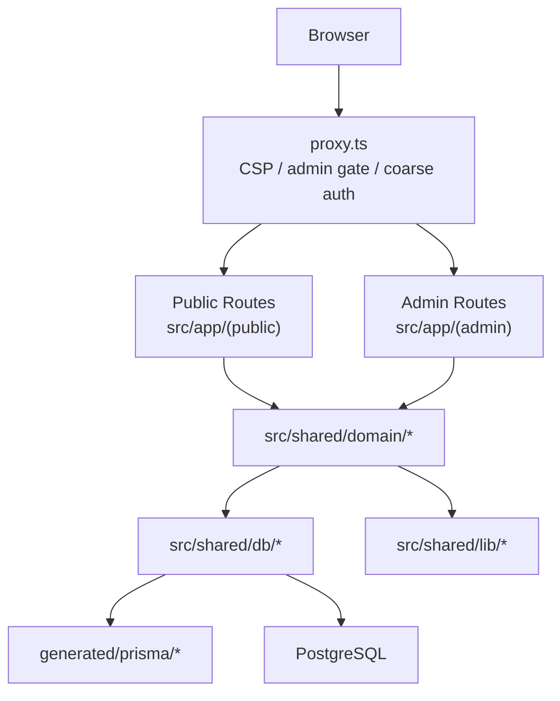

# システムアーキテクチャ

最終更新: 2026-03-22

## 概要

このプロジェクトは Next.js 16 App Router を基盤にした、公開サイトと管理画面を同居させたレンタルスペース運営システムです。UI は route group 単位で完全分離し、業務ロジックは `src/shared/domain/*`、インフラは `src/shared/lib/*` / `src/shared/db/*` に閉じ込めます。

## 境界

### 1. UI 境界

- `src/app/(public)` は公開 UI 専用。デザイン、アニメーション、SEO、導線を担当する
- `src/app/(admin)` は管理 UI 専用。業務オペレーションとエディタを担当する
- Public ↔ Admin 間は Multiple Root Layouts によりフルリロード前提

### 2. ドメイン境界

- `src/shared/domain/settings`
- `src/shared/domain/navigation`
- `src/shared/domain/dashboard`
- `src/shared/domain/audit-log`
- `src/shared/domain/block-template`
- `src/shared/domain/coupons`
- `src/shared/domain/customers`
- `src/shared/domain/faq`
- `src/shared/domain/instagram`
- `src/shared/domain/inquiries`
- `src/shared/domain/locations`
- `src/shared/domain/pages`
- `src/shared/domain/post-comments`
- `src/shared/domain/sections`
- `src/shared/domain/posts`
- `src/shared/domain/news`
- `src/shared/domain/editor-comments`
- `src/shared/domain/media`
- `src/shared/domain/reservations`
- `src/shared/domain/spaces`
- `src/shared/domain/staff-invitations`
- `src/shared/domain/space-categories`
- `src/shared/domain/terms`
- `src/shared/domain/users`
- `src/shared/domain/user-page-assignments`

現時点では公開ルーティングと公開データ取得の中核を domain に移設済み。`src/app/(public)` からの Prisma 直参照は禁止し、公開側の DB query wrapper は残さない。`settings` context は `queries.ts`, `admin-queries.ts`, `api-key-queries.ts`, `api-key-commands.ts`, `commands.ts`, `announcement-bar.ts`, `types.ts`, `robots-txt.ts` に分割済みで、Google Calendar 設定・Webhook 状態・双方向同期設定・iCal トークン/フィード設定、Analytics 設定、管理画面 branding 取得も同境界に収容する。`navigation` context は `queries.ts` と `commands.ts` に分割済み。`pages` と `sections` は `queries.ts`, `admin-queries.ts`, `commands.ts`, `system-pages.ts`, `types.ts` に分割済みで、公開取得・管理一覧・system page bootstrap・homepage/page section 編集を同境界へ収容する。`posts` context も `queries.ts`, `admin-queries.ts`, `commands.ts`, `routing.ts`, `types.ts` に分割済みで、公開取得・管理一覧・publish/versioning・taxonomy 管理を同境界へ収容する。`news` context も `queries.ts`, `admin-queries.ts`, `commands.ts`, `types.ts` に分割済みで、公開取得・管理一覧・publish/versioning を同境界へ収容する。`faq` context も `queries.ts`, `commands.ts`, `types.ts` に分割済みで、カテゴリ/項目の管理一覧・状態変更・並び替えを同境界へ収容する。`instagram` context も `queries.ts`, `commands.ts`, `types.ts` に分割済みで、接続設定・手動投稿・OAuth callback・token refresh を同境界へ収容する。`spaces`, `reservations`, `media`, `editor-comments` も query/command 境界へ移設済みで、一覧・詳細・作成更新・storage / calendar / comment thread 操作を同境界へ収容する。管理画面の read/write は `dashboard`, `audit-log`, `block-template`, `post-comments`, `posts`, `news`, `faq`, `terms`, `inquiries`, `instagram`, `locations`, `space-categories`, `customers`, `coupons`, `users`, `staff-invitations`, `settings/api-keys`, `pages`, `sections`, `spaces`, `reservations`, `media`, `editor-comments` まで domain 正本へ移設済み。`app` 層は generated Prisma model / client type を直接参照せず、必要な read model は `shared/domain/*/types.ts` を正本にする。加えて `app/api/*`, admin lib, calendar / iCal / sitemap / bootstrap helper も domain query/command を正本にしたため、`src/shared/domain/*` と `src/shared/db/*` の外に Prisma 直 import を残さない。Better Auth の Prisma adapter も `src/shared/db/better-auth-adapter.ts` に隔離し、`shared/lib/auth.ts` は DB client を直接握らない。

### 3. DB 境界

- `src/shared/db/*` が Prisma の唯一の公開窓口
- **クライアント拡張**（`$extends` / Decimal→number）の実装は **`create-app-prisma-client.ts`** に集約。Next のシングルトン（`prisma.ts`）と **`prisma/seed.ts`** はいずれも **`createAppPrismaClient`** を通す（型 `AppPrismaClient` を共有）
- Better Auth 用は拡張前ベースクライアント **`basePrisma`** のみアダプターに渡す（`prisma.ts`）
- **`@/shared/db/prisma.ts`** は `server-only`。seed / Bun スクリプトは **`@/shared/db/prisma` を import せず**、自前の `PrismaClient` + `createAppPrismaClient` または domain の「`PrismaClient` を引数で受けるコマンド」を使う
- `src/shared/db/prisma.ts`, `src/shared/db/create-app-prisma-client.ts`, `src/shared/db/enums.ts`, `src/shared/db/better-auth-adapter.ts` を境界の中心とし、barrel / model shim は置かない
- Prisma 生成物は `generated/prisma/*` に配置し、`src/` 配下へ置かない
- Prisma 生成物は git 管理せず、`prisma generate` を install / validate / test / build の前に実行する
- アプリ本体から `@generated/prisma/*` を直接 import しない

### 4. 管理画面の read / write 境界

- `src/proxy.ts` は admin の coarse check のみを担当し、本認可の正本にしない
- Server Component の read は `@/admin/queries/*` から private query を直接呼ぶ
- Client Component の read は `/admin/api/*` の Route Handler だけを使う
- `@/admin/actions/*` は mutation を正本にし、read 用 API としては使わない
- private query の入口は `requireAdminPermission()` / `requireAdminResourcePermission()` に統一し、権限不足を `null` / 空配列でぼかさない
- `EDITOR` の page scope は `user_page_assignments` を使って private query / route handler の一覧取得にも反映する

### 5. 認証設定の例外境界

- Better Auth は `export const auth = betterAuth(...)` の静的初期化を正本にする
- Google OAuth provider 設定は env / Secret Manager を正本にし、DB から上書きしない
- auth 初期化ロジックに DB 駆動 provider 設定を持ち込まない

## ルーティングポリシー

### 公開ページ

- 固定ページ: `/`, `/about`, `/contact`, `/faq`, `/privacy`, `/reservation`, `/spaces`, `/terms`
- ニュース:
  - 一覧 `/news`
  - 詳細 `/news/[slug]`
  - preview `/news/preview/[slug]`
- 投稿:
  - 一覧 `/posts`
  - 詳細 `/posts/[...segments]`
  - preview `/posts/preview/[slug]`
- カスタムページ:
  - `src/app/(public)/[...segments]/page.tsx`
  - 1 segment は `custom page` を優先
  - 投稿 prefix 無効時のみ、custom page で解決できないパスを投稿詳細へ fallback

### 投稿 permalink 解決

`src/shared/domain/posts/routing.ts` が以下を解決する。

- `post_name`: `/posts/[slug]` または `/{slug}`
- `category_name`: `/posts/[category]/[slug]` または `/{category}/{slug}`
- `date_name`: `/posts/[year]/[month]/[slug]` または `/{year}/{month}/{slug}`

canonical URL は常に現在の permalink 設定から再生成する。代替経路で表示されても canonical は設定値へ収束させる。

### proxy の責務

`src/proxy.ts` は次だけを担当する。

- CSP nonce と共通セキュリティヘッダー
- API rate limit と cron secret 検証
- `/admin/login` と `/admin/setup/[token]` の optimistic gate
- `/admin/*` の coarse auth

公開 permalink rewrite や Prisma 参照は持たない。
`/admin/login` gate は token の存在確認だけを行い、本検証と `admin-gate` cookie 発行は `src/app/api/admin/login-tokens/authorize/route.ts` で行う。署名付き token は one-time で、Route Handler が署名検証と DB 消費を担当する。

## レンダリング戦略

### 公開 shell

- `src/app/(public)/layout.tsx` は Header / Footer / SEO / Cookie Consent / Analytics / a11y を持つ
- 公開側で `useQueryState(s)` を使うため **`NuqsAdapter`** で `children` をラップする。Codex では `docs/guides/nuqs.md` と近接実装を参照する。管理画面用アダプタ（`(dashboard)/layout.tsx`）とは Multiple Root Layouts により別 subtree
- URL 同期は nuqs に限定し、独自の URL 用 React Context をルートに広げない
- blanket な `connection()` は使わない
- 年表示のような時刻依存 UI は leaf component へ分離する

### ExperienceShell

- Lenis、Scroll orchestration、VisualEffectsProvider、PerformanceMonitor は `ExperienceShell` に集約
- グローバル layout では読み込まず、演出が必要なページだけ opt-in する
- 現在はホームページが opt-in 済み

### Preview

- 通常詳細ページに query-string preview 分岐は持たない
- preview は `posts` / `news` の専用 route でのみ描画し、常に `noindex`

## データ取得とキャッシュ

- 読み取りは `'use cache'` + `cacheLife()` + `cacheTag()` を基本とする
- 投稿 URL を返す query は `CACHE_TAGS.PERMALINK` も付与し、permalink 設定変更で無効化できるようにする
- 更新直後の read-your-own-writes が必要な箇所は `updateTag()`
- 遅延再検証でよい箇所は `revalidateTag()`

## 管理画面の方針

- 管理画面は引き続き route group 内に UI を保持する
- write 系 Server Action は `権限確認 + Zod 入力検証 + domain command 呼び出し + cache invalidation` の thin adapter を正本にする
- `navigation`, `announcementBar`, `blockTemplate`, `customers`, `coupons`, `faq`, `ical-tokens`, `inquiries`, `instagram`, `locations`, `news`, `post-comments`, `posts`, `space-categories`, `staff-invitations`, `terms`, `users`, `settings/api-keys`, `settings/basic`, `settings/business`, `settings/email`, `settings/other`, `settings/discount`, `settings/tax`, `settings/robots-txt`, `settings/google-calendar`, `settings/stripe` は `executeAdminMutation()` + domain command へ移行済み
- `dashboard`, `audit-log` の read 系は admin action から Prisma を外し、domain query を正本にする
- それ以外の admin action は同パターンへ段階的に移行する

## 静的検証ルール

- `proxy.ts` に Prisma import を置かない
- `src/shared/db/*` の外で `@generated/prisma/*` を import しない
- `@/shared/lib/prisma` の legacy shim import を残さない
- `src/shared/domain/*` と `src/shared/db/*` の外で `@/shared/db/prisma` を import しない
- `src/shared/db/index.ts`, `src/shared/db/client.ts`, `src/shared/db/models/*` のような互換 shim を再導入しない
- `src/app/*` から `@/shared/db/client` と `@/shared/db/models/*` を import しない
- `bun run validate`, `bun test`, `bun run build` を通す
