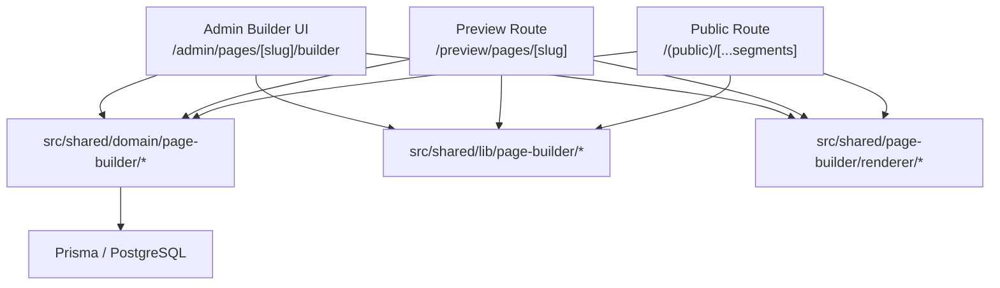

# Freeform Page Builder Design

> WIX / STUDIO 系の自由配置エディタを、このプロジェクトに clean-break で追加するための設計書。

最終更新: 2026-04-24

## 概要

現行のページ管理は `Page` + `Section` + `Section.config` を正本とした構造化 CMS であり、セクションの追加・並び替え・設定編集には適している。一方で、WIX / STUDIO のような自由配置エディタに必要な「要素単位の absolute 配置」「ブレークポイントごとのレイアウト差分」「ドラッグ・リサイズ・レイヤー編集」は現行モデルの責務外である。

リリース前で後方互換性を維持する必要がないため、custom page は **構造化 CMS から freeform builder へ clean-break で置き換える**。共存用の dual mode は持たず、custom page の正本は freeform document に一本化する。

## 設計方針

- custom page の正本を `Section` から freeform document に置き換える
- 管理画面 canvas / preview route / 公開ページで **同じ renderer** を使う
- autosave 用の draft と公開用の published document を分離する
- node schema は Zod で検証し、任意 HTML / 任意 script を v1 では許可しない
- document parser は `schemaVersion: 4` のみを受け付け、過去 schema の runtime migration は持たない
- system page は既存の専用管理面に残し、freeform builder の対象外とする
- レイアウトは breakpoint ごとの override を持ち、desktop / tablet / mobile を第一級で扱う
- 自由配置は可能にするが、全ノードを常に absolute にせず `frame`, `stack`, `grid` を併用できる構造にする
- 共存のための `editorMode` や runtime importer は持たない

## 背景と問題

現行のページ編集 UI は 3 面構成まで進んでいるが、保存モデルは `Page.pageHero`, `Section.config`, `Section.contentJson` に依存している。これは「セクションという単位で編集する CMS」としては妥当だが、WIX / STUDIO 型の編集体験とは前提が異なる。

自由配置エディタで必要になるのは次の責務である。

- 要素単位の座標・サイズ・重なり順の保存
- ブレークポイント別の配置差分管理
- canvas 上の選択、複数選択、整列、スナップ、ガイド表示
- draft と publish の分離
- ノードツリーと render tree の一貫した再構築

これらは現行 `Section` モデルに無理に乗せるべきではない。`Section` に `x`, `y`, `w`, `h` を追加していくと、構造化 CMS と freeform builder の責務が衝突し、公開 renderer も保守不能になる。

また、共存期間を前提に `sections` と `freeform` の両モードを長く抱えると、作成フロー、公開分岐、テスト、運用手順のすべてが複雑になる。今回はリリース前で breaking change を許容できるため、custom page は clean-break で freeform 側へ寄せる。

## 対象範囲

### In scope

- `/admin/pages/[slug]/builder` の新設
- custom page 向け freeform document 編集
- desktop / tablet / mobile の 3 breakpoint
- layer tree, canvas, inspector, asset picker, undo / redo, autosave, publish
- preview route での draft / published 確認
- freeform 専用 public renderer
- custom page の作成フローを freeform builder 前提に置き換える

### Out of scope

- 既存 system page の即時移行
- post / news / terms の本文を freeform builder に統合
- 任意 HTML, 任意 script, custom React component の埋め込み
- 複数人同時編集
- Figma 互換 import
- custom page 用 `sections` editor との長期共存

## アーキテクチャ図



## 全体構成

### 1. page 種別の整理

`Page` は次の 2 系統に整理する。

- `isSystemPage = true`: 既存の system page。専用管理面または専用 renderer を維持
- `isSystemPage = false`: custom page。freeform builder を唯一の編集面にする

つまり custom page に対しては `sections` editor を残さない。

### 2. document 正本の分離

freeform builder は `Section` を使わず、1 つの JSON document を正本とする。document は page tree, node props, layout, styles, breakpoint overrides を内包する。

### 3. renderer の単一化

編集画面の canvas と、preview route と、公開ページは同じ renderer を利用する。管理画面だけが selection overlay, drag handles, resize handles を上に重ねる。

これにより、プレビュー専用の擬似 UI を別実装しない。

### 4. admin builder shell

`/admin/pages/[slug]/builder` は通常の `AdminDetailLayout` 配下に置かず、管理画面の fullscreen mode を使う専用制作アプリ shell とする。

- topbar: page title, breakpoint switcher, zoom, undo / redo, save, preview, publish
- left rail: Insert / Layers / Assets / Revisions
- left panel: 選択中 rail の詳細操作
- center stage: shared renderer を配置した canvas
- right inspector: selected node の content / layout / style / visibility 編集

通知 toast は bottom-right に寄せ、topbar の save / publish 操作を塞がない。

## データモデル

### 推奨 Prisma 追加

`Page` には既存の system/custom 判定のみを残し、document 本体は別モデルへ切り出す。

```prisma
model Page {
  id          String   @id @default(uuid()) @db.Uuid
  slug        String   @unique
  title       String
  freeformState PageFreeformState?
}

model PageFreeformState {
  pageId              String   @id @db.Uuid
  draftDocument       Json
  publishedDocument   Json?
  draftVersion        Int      @default(1)
  publishedVersion    Int?
  lastPublishedAt     DateTime?
  createdAt           DateTime @default(now())
  updatedAt           DateTime @updatedAt

  page Page @relation(fields: [pageId], references: [id], onDelete: Cascade)
}

model PageFreeformRevision {
  id          String   @id @default(uuid()) @db.Uuid
  pageId      String   @db.Uuid
  version     Int
  kind        String   @db.VarChar(32) // autosave | manual | publish
  document    Json
  createdById String?  @db.Uuid
  createdAt   DateTime @default(now())

  @@index([pageId, version])
}
```

### 採用理由

- `Page` に巨大 JSON を直接持たせず、page の基本メタデータと builder state を分離できる
- draft と published を並行保持できる
- autosave と publish の責務を分けられる
- revision を後から追加しやすく、undo 履歴の永続化にも拡張できる
- custom page のみ `PageFreeformState` を持つ運用にできる

## document schema

### Top-level

```ts
type PageBuilderDocument = {
  schemaVersion: 4;
  rootId: string;
  nodes: Record<string, BuilderNode>;
  breakpoints: {
    desktop: BreakpointDefinition;
    tablet: BreakpointDefinition;
    mobile: BreakpointDefinition;
  };
  canvas: {
    width: "full" | "boxed";
    background: BackgroundStyle;
  };
  seo?: {
    title?: string;
    description?: string;
    ogImageMediaId?: string;
  };
};
```

### Node

```ts
type BuilderNode =
  | RootNode
  | FrameNode
  | StackNode
  | GridNode
  | TextNode
  | ImageNode
  | ButtonNode
  | DividerNode
  | SpacerNode
  | EmbedNode
  | FormNode;

type BaseNode = {
  id: string;
  type: string;
  parentId: string | null;
  children: string[];
  locked: boolean;
  visibility: {
    base: boolean;
    overrides: {
      tablet?: boolean;
      mobile?: boolean;
    };
  };
  name: string;
  layoutMode: "absolute" | "stack" | "grid";
  style: NodeStyle;
  layout: {
    base: LayoutBox;
    overrides: {
      tablet?: Partial<LayoutBox>;
      mobile?: Partial<LayoutBox>;
    };
  };
};
```

### LayoutBox

```ts
type LayoutBox = {
  x: number;
  y: number;
  width: number | "hug" | "fill";
  height: number | "hug" | "fill";
  rotate: number;
  zIndex: number;
};
```

### v1 node types

- `root`: ページ全体のルート
- `frame`: 任意コンテナ。自由配置の親
- `stack`: 縦横 auto layout
- `grid`: カード一覧や 2 カラム用
- `text`: 見出し、本文、リンク付きテキスト
- `image`: 単体画像
- `button`: CTA
- `divider`: 区切り線
- `spacer`: 余白
- `embed`: map, YouTube, Instagram 等の安全な埋め込み
- `form`: 問い合わせフォームや予約導線の埋め込み

### NodeStyle

`NodeStyle` は全ノード共通の装飾面を担う。

- spacing
- border
- radius
- shadow
- background
- opacity
- typography
- flex / align
- animation preset

色や余白は Tailwind class 文字列を持たず、semantic token と数値ベースの style payload を保持する。render 時にトークンへ解決する。

## ブレークポイント設計

### ルール

- 正本は `desktop`
- `tablet`, `mobile` は差分 override のみ持つ
- override が無い項目は親 breakpoint から継承する

### 採用理由

- WIX / STUDIO と同様に desktop から崩していく操作に合う
- 全 breakpoint に完全複製を持たせるより document が小さくなる
- layout diff の比較と migration がしやすい

### v1 breakpoint

- `desktop`: 1280 base
- `tablet`: 768 base
- `mobile`: 390 base

## 編集 UI 設計

### レイアウト

- 左: Pages / Layers / Assets / Components
- 上: device switch, zoom, undo, redo, save status, preview, publish
- 中央: canvas
- 右: Inspector / Design / Layout / Content / Animation

### 主な操作

- click: node 選択
- shift+click: 複数選択
- drag: 移動
- resize handle: 幅・高さ変更
- alt+drag: 複製
- arrow key: 微調整
- shift+arrow: 10px 単位移動
- cmd/ctrl+g: group 化
- cmd/ctrl+d: 複製
- cmd/ctrl+z / shift+cmd/ctrl+z: undo / redo

### canvas overlay

編集用 overlay は renderer 本体と分離し、次だけを担当する。

- selection border
- resize handles
- alignment guides
- snap lines
- hover target
- drop indicator

公開 renderer 側には一切含めない。

## render pipeline

### 公開ページ

`src/app/(public)/[...segments]/page.tsx` は page の種別で分岐する。

- system page: 既存 renderer
- custom page: `FreeformPageRenderer`

### preview

`/preview/pages/[slug]` は query parameter か admin session に応じて draft / published を切り替える。preview route も `FreeformPageRenderer` を使う。

### 管理画面 canvas

管理画面の canvas も同じ `FreeformPageRenderer` を使い、`editable` フラグと selection state を渡して overlay を重ねる。

## 管理画面と公開側の責務分離

### `src/shared/domain/page-builder/*`

- freeform state query
- draft save
- publish
- revision snapshot
- permission check 付き admin query

### `src/shared/lib/page-builder/*`

- Zod schema
- migration
- normalize
- breakpoint inheritance
- selection math
- snapping math

### `src/shared/page-builder/renderer/*`

- node renderer
- style resolver
- asset resolver
- SSR / client 両対応の render 層

### `src/app/(admin)/admin/(dashboard)/pages/[slug]/builder/*`

- builder shell
- layer panel
- component palette
- inspector
- keyboard shortcuts
- canvas overlay

## 保存・公開フロー

### Draft autosave

- 編集操作は client state に反映
- debounce 後に `saveDraftPageDocument` を呼ぶ
- save / publish / revision restore は `expectedDraftVersion` を必須入力にする
- server 側で `draftVersion` compare-and-swap を行い、古い tab からの上書きを拒否する
- 保存成功時に `draftVersion` を更新
- conflict 時は local merge を試みず、最新 draft の reload を唯一の復帰手段にする

### Publish

- `publishPageDocument` 実行時に `draftDocument` を `publishedDocument` へコピー
- `publishedVersion`, `lastPublishedAt` を更新
- キャッシュタグ `page:{pageId}` と `page-builder:{pageId}:published` を更新

### Preview

- builder 内プレビューは draft を表示
- 公開サイトは published のみ表示

この分離により、WIX 型の「保存はされたが未公開」を表現できる。

## セキュリティ制約

- document には任意 HTML を保存しない
- embed は許可制 provider のみ
- media は URL 直書きでなく `mediaId` 基準を優先する
- custom CSS text area は v1 では提供しない
- Link URL は既存 safe URL schema と同等の検証を通す
- publish mutation は `executeAdminMutationResult` 配下に置く

## キャッシュ戦略

- draft query は admin 専用で動的取得
- published query は `'use cache'` + `cacheTag('page-builder:' + pageId + ':published')`
- publish 時は `updateTag()` で read-your-own-writes を保証

## 既存 custom page との切り替え

### v1 のルール

- system page は既存の仕組みを維持する
- custom page は `/admin/pages/[slug]/builder` を唯一の編集面にする
- custom page 作成時に editor mode は選ばせない

### リリース前の clean-break

- 既存 custom page の `Section` ベース編集は破棄対象とする
- 必要な既存 custom page がある場合は one-off migration script で document へ移すか、リリース前に再構築する
- リリース前確認では `bun run audit:freeform-pages` を実行し、`PageFreeformState` がない custom page と legacy `sections` が残る page を洗い出す
- runtime 上で `sections` / `freeform` を切り替える互換レイヤーは持たない

この方針により、リリース後のコードパスを単純化できる。

## トレードオフ

| 選択肢                                 | メリット                           | デメリット                                    |
| -------------------------------------- | ---------------------------------- | --------------------------------------------- |
| `Section` 拡張で WIX 化                | 既存 UI を流用しやすい             | モデル責務が崩れ、保守不能になりやすい        |
| custom page を freeform builder へ置換 | runtime が単純で保守しやすい       | 既存 custom page を破壊的に移行する必要がある |
| document を `Page` に直接持つ          | 実装が単純                         | draft/published 分離と履歴管理が弱い          |
| `PageFreeformState` を分離             | publish と autosave を分離しやすい | テーブルが増える                              |

**採用**: custom page を freeform builder へ clean-break で置換し、`PageFreeformState` で draft / published を分離する。理由は、WIX / STUDIO 型の体験を実現するには document 指向のモデルが必要で、custom page を旧 `Section` CMS と共存させると runtime と運用が不要に複雑化するため。

## 段階実装

### Phase 1

- Prisma schema 追加
- document schema / domain query / commands
- custom page 作成フローを builder 前提に切り替え
- `/admin/pages/[slug]/builder` の shell だけ追加

### Phase 2

- text / image / button / frame / stack の v1 node
- canvas 選択、ドラッグ、リサイズ
- layer panel
- autosave

### Phase 3

- publish / preview
- tablet / mobile breakpoint
- public renderer 接続

### Phase 4

- grid / form / embed / animation
- alignment guides
- keyboard shortcuts 強化
- revision restore

## 実装上の注意

- renderer は admin 専用 state を持ち込まず、純粋に document から描画する
- canvas overlay は renderer と別レイヤーに保つ
- Node schema は discriminated union で定義し、migration で `schemaVersion` を吸収する
- 重い drag 処理は client island に閉じる
- autosave は optimistic update + debounce + latest-write-wins を基本にする

## 推奨ディレクトリ

```text
src/
├── app/
│   └── (admin)/admin/(dashboard)/pages/[slug]/builder/
├── shared/
│   ├── domain/page-builder/
│   ├── lib/page-builder/
│   └── page-builder/
│       ├── renderer/
│       ├── canvas/
│       ├── inspector/
│       └── nodes/
```

## 結論

WIX / STUDIO のような自由配置エディタは、このプロジェクトでも実装できる。ただし、それは既存 `Section` CMS の延長ではなく、**custom page を置き換える document-driven builder** として設計する必要がある。

リリース前で後方互換性が不要なら、custom page は clean-break で freeform builder へ寄せるのが最もシンプルで保守しやすい。

## 参考資料

- [ARCHITECTURE.md](./ARCHITECTURE.md)
- [page-sections-design-guide.md](./page-sections-design-guide.md)
- [0017-section-style-cascade.md](./decisions/0017-section-style-cascade.md)
- [0020-page-preview-reuses-public-renderer.md](./decisions/0020-page-preview-reuses-public-renderer.md)
