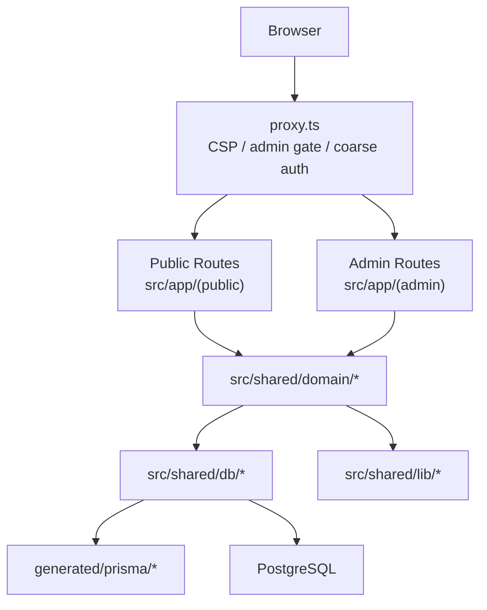

# システムアーキテクチャ

## 概要

このプロジェクトは Next.js 16 App Router を基盤にした、公開サイトと管理画面を同居させたレンタルスペース運営システムです。UI は route group 単位で完全分離し、業務ロジックは `src/shared/domain/*`、インフラは `src/shared/lib/*` / `src/shared/db/*` に閉じ込めます。

## 境界

### 1. UI 境界

- `src/app/(public)` は公開 UI 専用。デザイン、アニメーション、SEO、導線を担当する
- `src/app/(admin)` は管理 UI 専用。業務オペレーションとエディタを担当する
- Public ↔ Admin 間は Multiple Root Layouts によりフルリロード前提

### 2. ドメイン境界

業務ロジックと読み取りモデルは `src/shared/domain/*` に集約する。**モジュール一覧とファイル分割の正本はリポジトリ内のディレクトリ**とし、この節での列挙はしない（リストはすぐ drift する）。

共通の約束だけをここに書く。

- `src/app/(public)`（および公開 API/route）から Prisma を直接 import しない。
- UI / route が Prisma の generated 型へ依存しない。公開する型は `shared/domain/*/types.ts` と DB ゲートウェイ経由を正とする。
- 各 bounded context は `queries.ts` / `commands.ts` / `types.ts` 等の役割分割を基本とし、必要に応じて `admin-queries.ts` や feature 特有のモジュールを追加する。
- `app/api/*`・admin 補助・calendar / iCal / sitemap 等も、データアクセスの正本は domain query・command に寄せる。
- Better Auth 用 Prisma adapter は `src/shared/db/better-auth-adapter.ts` に隔離し、`shared/lib/{admin,customer}-auth.ts` は DB client を直接握らない。

### 3. DB 境界

- `src/shared/db/*` が Prisma の唯一の公開窓口
- **クライアント拡張**（`$extends` / Decimal→number）の実装は **`create-app-prisma-client.ts`** に集約。Next のシングルトン（`prisma.ts`）と **`prisma/seed.ts`** はいずれも **`createAppPrismaClient`** を通す（型 `AppPrismaClient` を共有）
- Better Auth 用は拡張前ベースクライアント **`basePrisma`** のみアダプターに渡す（`prisma.ts`）
- **`@/shared/db/prisma.ts`** は `server-only`。seed / Bun スクリプトは **`@/shared/db/prisma` を import せず**、自前の `PrismaClient` + `createAppPrismaClient` または domain の「`PrismaClient` を引数で受けるコマンド」を使う
- `src/shared/db/prisma.ts`, `src/shared/db/create-app-prisma-client.ts`, `src/shared/db/enums.ts`, `src/shared/db/better-auth-adapter.ts` を境界の中心とし、barrel / model shim は置かない
- Prisma 生成物は `generated/prisma/*` に配置し、`src/` 配下へ置かない
- Prisma 生成物は git 管理せず、`prisma generate` を install / validate / test / build の前に実行する
- アプリ本体から `@generated/prisma/*` を直接 import しない

### 4. 管理画面の read / write 境界

- `src/proxy.ts` は admin の coarse check のみを担当し、本認可の正本にしない
- Server Component の read は `@/admin/queries/*` から private query を直接呼ぶ
- Client Component の read は `/admin/api/*` の Route Handler だけを使う
- `@/admin/actions/*` は mutation を正本にし、read 用 API としては使わない
- private query の入口は `requireAdminPermission()` / `requireAdminResourcePermission()` に統一し、権限不足を `null` / 空配列でぼかさない
- `EDITOR` の page scope は `user_page_assignments` を使って private query / route handler の一覧取得にも反映する

### 5. 認証設定の例外境界

- Better Auth は `export const auth = betterAuth(...)` の静的初期化を正本にする
- Google OAuth provider 設定は env / Secret Manager を正本にし、DB から上書きしない
- auth 初期化ロジックに DB 駆動 provider 設定を持ち込まない

## ルーティングポリシー

公開ルートの URL 一覧・動的 segment・custom page と投稿の fallback 関係は、`src/app/(public)` と `src/shared/domain/posts/routing.ts` を正本とする。ここでは設計上の要点だけ示す。

| カテゴリ       | 要点                                                                                  |
| -------------- | ------------------------------------------------------------------------------------- |
| 固定ページ     | 明示的な `page.tsx` を持つ route                                                      |
| ニュース       | 一覧・詳細・preview の専用 route                                                      |
| 投稿           | permalink モードに応じて `routing.ts` が canonical を解決                             |
| カスタムページ | `[...segments]` で解決。詳細は [content-managed-pages.md](./content-managed-pages.md) |

### 投稿 permalink 解決

`src/shared/domain/posts/routing.ts` が `post_name` / `category_name` / `date_name` の別パターンを解決する。canonical は常に現在の permalink 設定へ収束させる。

### proxy の責務

`src/proxy.ts` は次だけを担当する。

- CSP nonce と共通セキュリティヘッダー
- API rate limit と cron secret 検証
- `/admin/login` と `/admin/setup/[token]` の optimistic gate
- `/admin/*` の coarse auth

公開 permalink rewrite や Prisma 参照は持たない。
`/admin/login` gate は token の存在確認だけを行い、本検証と `admin-gate` cookie 発行は `src/app/api/admin/login-tokens/authorize/route.ts` で行う。署名付き token は one-time で、Route Handler が署名検証と DB 消費を担当する。

## レンダリング戦略

### 公開 shell

- `src/app/(public)/layout.tsx` は Header / Footer / SEO / Cookie Consent / Analytics / a11y を持つ
- 公開側で `useQueryState(s)` を使うため **`NuqsAdapter`** で `children` をラップする。Codex は [`AGENTS.md`](../../AGENTS.md) + 近接実装（`src/shared/lib/nuqs/*`）、Claude Code は `.claude/rules/frontend/forms-ssr.md` を入口にする。管理画面用アダプタ（`(dashboard)/layout.tsx`）とは Multiple Root Layouts により別 subtree
- URL 同期は nuqs に限定し、独自の URL 用 React Context をルートに広げない
- blanket な `connection()` は使わない
- 年表示のような時刻依存 UI は leaf component へ分離する

### スクロール・演出（Lenis / GSAP）

- スムーススクロールは `LenisProvider` で提供（`src/app/(public)/layout.tsx`）。GSAP・ScrollTrigger 連携は [GSAP 公式 docs](https://gsap.com/docs/v3/) とページ近傍の実装、および Claude Code 作業時は `.claude/rules/frontend/gsap/*.md`（path-scoped で auto-load）を参照。
- 演出コストが高い処理はページ・セクション単位で読み込みを抑える。

### Preview

- 通常の詳細ページには query-string の preview 分岐を持たせない。
- preview は `(public)/preview/{posts,news,pages}/*` 配下の専用 route のみで描画し、常に `noindex`。

## データ取得とキャッシュ

理由・レイヤリング・タグ設計は [caching.md](./caching.md) に集約する。

## 管理画面の方針

- UI と thin adapter は引き続き route group 内に置く。
- mutation は「権限確認 → Zod → domain command → キャッシュ無効化」を基本とし、`executeAdminMutationResult` を共通入口にする。
- read は Server Component の `@/admin/queries/*`、クライアント側は `/admin/api/*` に統一する。
- 個別リソースの移行状況はコードが正本。一覧を docs に複製しない。

## 静的検証ルール

上記の境界違反は `__tests__/unit/architecture-boundaries.test.ts` が runtime gate として検出する（lefthook `pre-push` + CI required）。具体的な検出パターン・対象 path・許容例外は実テストファイルを SSoT とし、本書には列挙しない（drift 防止）。

加えてローカル / CI 双方で `bun run validate`、`bun test`、`bun run build` を通すこと。
