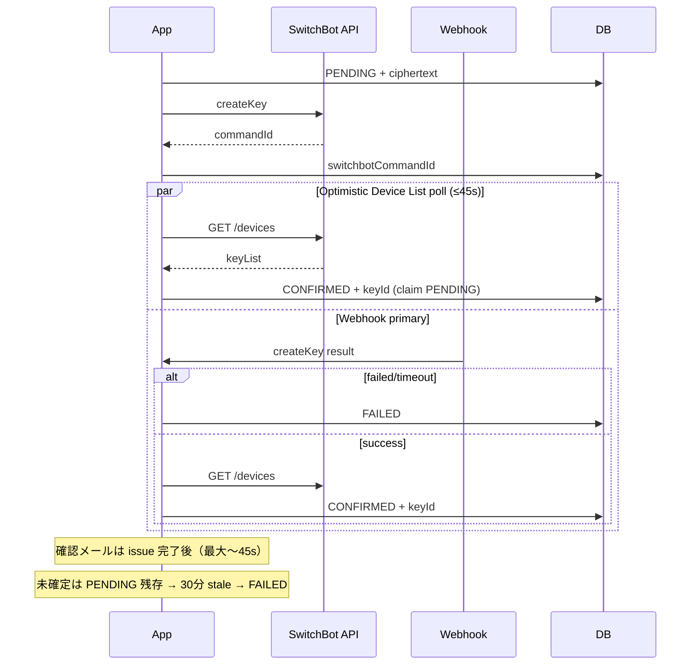
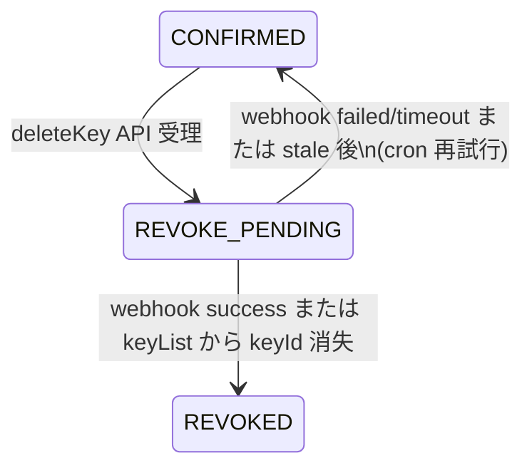

# SwitchBot 公式準拠クリーン redesign

**Date:** 2026-07-24  
**Status:** Approved — implement (clean break, no backward compat)  
**Scope:** Keypad / Keypad Touch / Keypad Vision / Keypad Vision Pro のみ  
**In scope (本 redesign + ドア状態):** 公式準拠パスコード + Lock Pro/Lite 等の錠状態表示  
**Out of scope (別 PR):** PENDING/REVOKED silent lockout、admin 編集 reissue 欠落、パス長エントロピー、管理画面からの remote lock/unlock

## 0. 背景とゴール

指紋認証パッド（Keypad Touch / Vision 系）を運用対象とする。現行実装は骨格は v1.1 だが、公式仕様と次の点でずれる。

| #   | ずれ            | 公式                                     | 現行                                                 |
| --- | --------------- | ---------------------------------------- | ---------------------------------------------------- |
| 1   | keyId 取得      | Device List の `keyList`                 | `GET /devices/{id}/status`（Status に keyList なし） |
| 2   | コマンド結果    | webhook 必須（非同期）                   | poll 主・webhook 高速パス                            |
| 3   | Lock Vision Pro | createKey webhook なし（lockState のみ） | enum/UI で選択可能                                   |
| 4   | deleteKey       | 非同期（webhook）                        | API `statusCode:100` で即 `REVOKED`                  |

**ゴール:** 後方互換レイヤを残さず、公式契約を SSoT にしたクリーン実装。プロジェクトの smart-lock / settings / webhook / cron 契約と整合し、予約確定 TX を壊さない。

**調査根拠:**

- 公式: [SwitchBotAPI](https://github.com/OpenWonderLabs/SwitchBotAPI) Keypad / Keypad Touch / Keypad Vision / Keypad Vision Pro / Lock Vision Pro device pages
- 実運用報告: Issue [#408](https://github.com/OpenWonderLabs/SwitchBotAPI/issues/408)（`/status` 空・`/devices` に keyList）、[#345](https://github.com/OpenWonderLabs/SwitchBotAPI/issues/345)（webhook 欠落・payload 揺れ）
- 並列調査（Composer）: deleteKey 非同期 / Device List keyList / `LOCK_VISION_PRO` enum 影響

---

## 1. 対象デバイス（クリーンブレイク）

ロールを公式どおり分ける。

| ロール                   | enum                                                           | 用途                                            |
| ------------------------ | -------------------------------------------------------------- | ----------------------------------------------- |
| **パッド（パスコード）** | `KEYPAD`, `KEYPAD_TOUCH`, `KEYPAD_VISION`, `KEYPAD_VISION_PRO` | createKey/deleteKey、予約パスコード             |
| **錠（状態監視）**       | `LOCK`, `LOCK_LITE`, `LOCK_PRO`                                | lockState / battery（＋ Pro は doorState）表示  |
| **除外**                 | ~~`LOCK_VISION_PRO`~~                                          | 本テナント未使用。Vision Pro 専用経路は入れない |

### パッド（パスコード）

公式: Device List に `keyList`、createKey/deleteKey 非同期、webhook に `eventName` + `commandId` + `result`。  
`Space.smartLockDeviceId` / Location デフォルトに割り当てられるのは **パッドのみ**（錠タイプは割当 UI に出さない）。

### 錠（ドア／施錠状態）— 本テナントは Lock Pro / Lock Lite 系

公式 webhook（Lock / Lock Lite / Lock Pro 共通パターン）:

```json
{
  "eventType": "changeReport",
  "context": {
    "deviceType": "WoLockPro" | "WoLockLite" | "WoLock",
    "deviceMac": "...",
    "lockState": "LOCKED" | "UNLOCKED" | "JAMMED",
    "battery": 0-100,
    "timeOfSample": 123456789
  }
}
```

- **Lock Lite**: Device Status に `lockState` + battery。`doorState` なし。
- **Lock Pro / Lock**: Device Status に `lockState` + **`doorState` (open/close)**。webhook 例には doorState が無い → 初回/手動 refresh で `/status` を読む。
- 錠は **createKey を持たない**（パスコード発行対象外）。`issueSmartLockPasscodes` はパッド type のみ。

### Keypad ↔ Lock の紐づけ

Keypad の Device List に `lockDeviceId`（ペア錠の MAC）がある。登録時:

1. パッド登録時に `pairedLockDeviceId`（自テナントの `SmartLockDevice.id`、nullable）を任意設定、または
2. Device List 取得で `lockDeviceId` が既登録錠と一致すれば自動リンク

管理 UI は拠点ごとに「パッド」「ペア錠の状態」を並べて表示する。

### `LOCK_VISION_PRO` 削除

**enum から完全削除**（soft deprecate なし）。

```sql
SELECT COUNT(*) FROM smart_lock_devices WHERE "deviceType" = 'LOCK_VISION_PRO';
```

- 0 件 → そのまま。1 件以上 → 運用削除 or migration 先頭 DELETE。
- enum 再作成は **breaking migration**（計画ダウンタイム）。**明示承認必須。**
- 同時に `LOCK` / `LOCK_LITE` / `LOCK_PRO` を **同じ TYPE 再作成**に含める（ADD VALUE だけの二段より、一回の breaking で確定させる）。

---

## 2. keyList / keyId 解決（Device List のみ）

### 契約

- `keyList` の SSoT は `GET /v1.1/devices` の該当デバイス。
- `GET /v1.1/devices/{id}/status` は keyList 非対応のため **本番コードから削除**（`getDeviceStatus` export 削除、fallback なし）。

### Client API（`switchbot-client.ts`）

```ts
// SwitchBotDeviceListItem に keyList?: SwitchBotKeyListItem[] を追加

findKeyInDeviceList(credentials, deviceId, name)
  → SwitchBotApiResult<SwitchBotKeyListItem | null>

findKeyByIdInDeviceList(credentials, deviceId, keyId)
  → SwitchBotApiResult<SwitchBotKeyListItem | null>

getDeviceListCached(credentials, { ttlMs?: number }) // 既定 ttl 2–5s、process 内
```

Domain 共通:

```ts
resolveSwitchbotKeyId(credentials, deviceMac, passcodeName): Promise<string | null>
```

issue-passcode / webhook-commands の突合はこの helper のみを使う。

### レート

- 公式日次 10,000 回。`/devices` は重いが回数課金。
- create 確定待ちの疎 poll は最大 **5 回 / 45s**（例: 0, 5, 15, 30, 45s）+ webhook との競合は TTL キャッシュで畳む。

---

## 3. createKey 確定セマンティクス（webhook 主）

### 役割分担（曖昧さを残さない）

| 関心                                   | 正本                      | 手段                                                                         |
| -------------------------------------- | ------------------------- | ---------------------------------------------------------------------------- |
| コマンド成否（success/failed/timeout） | **webhook**               | `eventName === "createKey"` + `result`                                       |
| keyId の物質化                         | **Device List keyList**   | `name`（`buildPasscodeName`）突合                                            |
| webhook 遅延時の楽観確定               | Device List に key が出現 | 疎 poll（副経路）。成否の失敗確定は webhook failed/timeout または stale cron |

コメント・テスト文言の「poll 主 / webhook 高速パス」はすべて書き換える。

### フロー



### Webhook route

- `eventType` は `"changeReport"` を要求（緩い `z.string()` をやめる）。
- `eventName` は **trim 後**に比較（createKey / deleteKey）。
- `commandId` は createKey では必須維持。deleteKey は §4 の tolerant 解析。

### 既存契約の維持

- poll/webhook とも `status=PENDING` claim（`updateMany`）で二重確定しない。
- 45s で未確定でも PENDING 維持（即 FAILED にしない）。
- `STALE_PENDING_THRESHOLD_MINUTES = 30` 維持。
- `issueSmartLockPasscodes` は例外を外に出さない（予約確定 TX 非破壊）。

---

## 4. deleteKey 非同期（REVOKE_PENDING）

### スキーマ（expand-only + enum ADD）

```prisma
enum SmartLockPasscodeStatus {
  PENDING
  CONFIRMED
  FAILED
  REVOKE_PENDING  // 新規: deleteKey 受理〜物理失効確定待ち
  REVOKED
}

model SmartLockPasscode {
  switchbotCommandId       String?   // createKey 用（現行）
  switchbotDeleteCommandId String?   // 新規: deleteKey 同期 commandId
  revokeRequestedAt        DateTime? // 新規: REVOKE_PENDING 開始
  // switchbotKeyId / revokedAt 維持
}
```

`REVOKE_PENDING` 追加と nullable 列は **additive**（breaking 非該当）。`LOCK_VISION_PRO` 削除 migration とは **同一 PR にまとめても可**だが、SQL レビュー上は「enum ADD」と「enum DROP/再作成」を明確に分ける（1 migration 内の順序: まず REVOKE_PENDING ADD VALUE → 列追加 → 最後に device type 再作成、または migration を 2 本に分割）。

**推奨 migration 分割:**

1. `add_smart_lock_revoke_pending` — `REVOKE_PENDING` + 列（additive）
2. `remove_lock_vision_pro_device_type` — breaking（明示承認）

### deletePasscode client

- 戻り型を createKey 対称に `{ commandId?: string }` へ変更（body に無ければ undefined）。
- 空 body でも受理（`statusCode === 100`）として扱い、相関は keyId / keyName fallback。

### revoke 状態機械



| From           | Event                                  | To                                                                 |
| -------------- | -------------------------------------- | ------------------------------------------------------------------ |
| CONFIRMED      | `deletePasscode` ok                    | REVOKE_PENDING（`switchbotDeleteCommandId` / `revokeRequestedAt`） |
| REVOKE_PENDING | webhook deleteKey + success + 相関一致 | REVOKED                                                            |
| REVOKE_PENDING | Device List に `switchbotKeyId` 不在   | REVOKED                                                            |
| REVOKE_PENDING | webhook failed/timeout                 | CONFIRMED（再試行可能）                                            |
| REVOKE_PENDING | stale（30 分、`revokeRequestedAt`）    | CONFIRMED + admin 通知                                             |
| CONFIRMED      | deleteKey API 失敗                     | CONFIRMED                                                          |

**即時 CONFIRMED→REVOKED は廃止。**

### Webhook deleteKey（tolerant）

公式例は `"eventName": "deleteKey "`（末尾スペース）。コミュニティ報告ではスペースなし・`commandId` 欠落・`keyName` ありもあり得る。

正規化ルール:

1. `eventName.trim() === "deleteKey"`
2. 相関優先順: `switchbotDeleteCommandId === commandId` → なければ `buildPasscodeName` と `context.keyName` → なければ device + `switchbotKeyId` の REVOKE_PENDING 行が 1 件ならそれ
3. `commandId` / `keyName` は Zod 上 optional（createKey 経路は別スキーマ or refine で create 時必須）

### cron

| 処理                                         | 対象                                      |
| -------------------------------------------- | ----------------------------------------- |
| `expireStalePendingSmartLockPasscodes`       | PENDING（発行）→ FAILED（現行）           |
| `expireStaleRevokePendingSmartLockPasscodes` | **新規** REVOKE_PENDING → CONFIRMED       |
| `findRevocableSmartLockPasscodes`            | **CONFIRMED のみ**（REVOKE_PENDING 除外） |
| stuck 警告（連携 OFF）                       | CONFIRMED + REVOKE_PENDING                |

### 他ドメイン整合

- デバイス削除ガード: live = `CONFIRMED` **または** `REVOKE_PENDING`
- `edit-side-effects` の deleteMany: `REVOKED`/`FAILED` のみ（REVOKE_PENDING 中は再発行前に失効完了を待つ、または revoke 完了後に進む — 実装時は「先に revoke フローを kick し、REVOKE_PENDING が残る場合は `issuanceFailed: true`」）

---

## 4b. ドア／施錠状態（管理画面）

### データ（`SmartLockDevice` に状態列 — 錠ロール用）

```prisma
model SmartLockDevice {
  // 既存フィールド...
  /// パッド→ペア錠（錠ロールの SmartLockDevice）
  pairedLockDeviceId String? @db.Uuid
  pairedLockDevice   SmartLockDevice?  @relation("PadToLock", fields: [pairedLockDeviceId], references: [id], onDelete: SetNull)
  pairedPads         SmartLockDevice[] @relation("PadToLock")

  /// webhook / status 由来（錠ロールのみ意味を持つ）
  lastLockState   String?   // 'LOCKED' | 'UNLOCKED' | 'JAMMED'（正規化大文字）
  lastDoorState   String?   // 'OPEN' | 'CLOSE' | null（Lite は常に null）
  lastBattery     Int?
  lastStateAt     DateTime?
}
```

別テーブルは作らない（1 デバイス 1 最新状態で十分。履歴は Phase 2）。

### Webhook

現行 changeReport スキーマを **二系統**に分岐:

1. **コマンド結果**（パッド）: `eventName` + `result` + optional `commandId` → 既存 create/delete 処理
2. **錠状態**（錠）: `lockState` あり・`eventName` なし → `deviceMac` で錠デバイスを特定し `lastLockState` / `lastBattery` / `lastStateAt` 更新

未知 `deviceMac` は現行どおり 200 + handled:false（パッドと同様）。

### Status refresh（doorState）

- Lock Pro / Lock: 管理 UI「状態を更新」または webhook 受信後ベストエフォートで `GET /devices/{id}/status` → `doorState` を正規化保存。
- Lock Lite: doorState 列は null のまま（公式に無い）。UI は「ドア開閉: 非対応」と明示。
- **注意:** ここだけ Status API を使う。keyList 用途では使わない（§2 と矛盾しない）。

### 管理 UI

- SwitchBot 設定のデバイス登録簿: タイプに錠 3 種を追加。パッド割当セレクトには出さない。
- 各錠行にバッジ: 施錠状態 / 電池 / ドア（Pro のみ）/ 最終更新（JST）。
- パッド行に「ペア錠: ○○（UNLOCKED）」を表示（`pairedLockDeviceId` 経由）。
- Location デフォルトカードはパッドのみ（錠は登録簿で完結）。

### 非ゴール（ドア状態）

- 管理画面から lock/unlock コマンド送信
- 状態履歴タイムライン
- 顧客（公開サイト）への表示
- 開閉に基づく自動通知（将来可）

---

## 5. ファイル変更マップ

| 領域            | ファイル                                                                                          |
| --------------- | ------------------------------------------------------------------------------------------------- |
| Client          | `src/shared/lib/smart-lock/switchbot-client.ts`                                                   |
| Issue           | `src/shared/domain/smart-lock/issue-passcode.ts`                                                  |
| Revoke          | `src/shared/domain/smart-lock/revoke-passcode.ts`                                                 |
| Webhook domain  | `src/shared/domain/smart-lock/webhook-commands.ts`                                                |
| Webhook route   | `src/app/api/webhooks/switchbot/[token]/route.ts`                                                 |
| Cron            | `src/app/api/cron/smart-lock-cleanup/route.ts`                                                    |
| Device commands | `src/shared/domain/smart-lock/commands.ts`（錠 CRUD・ペアリンク・status refresh）                 |
| Schema          | `prisma/schema.prisma` + 新規 migrations（REVOKE_PENDING additive + device type 再作成 breaking） |
| Labels/UI       | `helpers.ts`, `SmartLockDeviceRegistry.tsx`（状態バッジ）、`types.ts`                             |
| Tests           | client / issue / webhook（create+delete+lockState）/ revoke / cron / registry 表示                |

---

## 6. テスト計画

1. Client: `getDeviceStatus` 削除、`findKeyInDeviceList` / deletePasscode commandId
2. Issue: Device List poll 回数・webhook claim 互換・PENDING 維持
3. Webhook: createKey + deleteKey（`"deleteKey "` / `"deleteKey"`）+ optional commandId
4. Revoke: CONFIRMED→REVOKE_PENDING→REVOKED、失敗で CONFIRMED 復帰、stale revoke
5. Cron: stale revoke ステップ、stuck に REVOKE_PENDING 含む
6. `bun run test:db:migrate` + 該当 unit + `bun run validate`

---

## 7. 非ゴール（明示）

- mypage へのパスコード表示追加
- admin 予約編集への reissue 接続（別 PR）
- PENDING/REVOKED 時の `issuanceFailed` ポリシー修正（別 PR、ただし本 redesign で REVOKE_PENDING 導入時に衝突しないよう §4 で定義）
- パスコード桁数変更（6→12）
- webhook path token ローテーション

---

## 8. リスクと緩和

| リスク                         | 緩和                                                   |
| ------------------------------ | ------------------------------------------------------ |
| `/devices` 負荷・日次上限      | 疎 poll + TTL キャッシュ                               |
| deleteKey webhook payload 揺れ | trim + optional commandId/keyName + keyList 不在       |
| webhook 未到着常態             | Device List 副経路 + 30 分 stale（create/revoke 対称） |
| breaking enum 削除             | 本番 COUNT 確認 + 明示承認 + 低トラフィック merge      |
| 予約メール遅延                 | 上限 45s 維持（現行 UX）                               |

---

## 9. 承認が必要な項目

1. **本設計全体** — Approved（実装進行）
2. **breaking migration** — Approved（clean break / 計画ダウンタイム許容）
3. 本番 `LOCK_VISION_PRO` 行 — migration 先頭で DELETE
4. **ドア状態を同一リリースに含める** — Approved

---

## 10. Spec self-review

- [x] Placeholder なし（TODO/TBD を残さない。実機確認は「実装時の検証ステップ」として §6 に含めず、§8 リスクに記載）
- [x] create と delete の状態機械が対称で矛盾しない
- [x] Out of scope を明示し scope creep を防止
- [x] breaking vs additive migration を分離推奨
- [x] 予約確定非破壊契約を維持
      )
