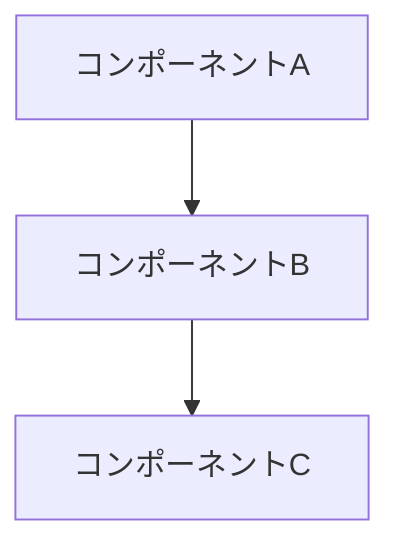

# タイトル

> 一行説明

## 概要

[設計の目的・背景]

## 設計方針

- [方針1]
- [方針2]

## アーキテクチャ図



## 実装詳細

### コンポーネント名

**責務**: [説明]

**インターフェース**:
```typescript
interface Example {
  id: string
  name: string
}
```

## トレードオフ

| 選択肢 | メリット | デメリット |
|--------|---------|-----------|
| A案 | xxx | yyy |
| B案 | xxx | yyy |

**採用**: A案（理由: xxx）

## 参考資料

- [ARCHITECTURE.md](./ARCHITECTURE.md)
